> Document de travail. Représentation N3 du parcours pédagogique de la phase 1.
> Sémantique : rectangles = étapes, losanges = décisions, cercles = synchros inter-équipiers, doubles cercles = livrables évalués, flèches pleines = flux normal, flèches pointillées = rétroactions, fond couleur = discipline.

## Vue d'ensemble

```mermaid
flowchart TD
    %% ============================
    %% NŒUDS
    %% ============================

    START(["Contexte projet communiqué<br/>(cadre, contraintes, budget,<br/>deadline, équipe)"]):::entry

    GP1["Gestion de projet<br/>Poser les jalons<br/>et identifier les risques"]:::transverse

    E2A["Rencontrer le client<br/>(entretien, questions ouvertes)"]:::etape
    E2B["Formaliser le besoin<br/>(bête à cornes, reformulation)"]:::etape
    D2{"Besoin<br/>stabilisé ?"}:::decision

    E3["Étudier l'existant<br/>(état de l'art, benchmark,<br/>briques réutilisables, point de départ)"]:::etape

    subgraph CDCF["Cahier des Charges Fonctionnel"]
        direction TB
        E4["Formaliser les fonctions<br/>(pieuvre : FP / FC / FS)"]:::etape
        E5["Caractériser les fonctions<br/>(critères, niveaux, flexibilité)"]:::etape
        D4{"CdCF défendable<br/>en soutenance ?"}:::decision
        E4 --> E5
        E5 --> D4
    end

    E6["Planifier le projet<br/>(WBS + rétroplanning depuis soutenance)"]:::etape
    S2A((Revue<br/>d'équipe)):::synchro
    L2[["Planning projet"]]:::livrable

    ESE1["Écoconception<br/>Première lecture environnementale<br/>(matériaux, usages, fin de vie)"]:::transverse

    E7["Rédiger le CdCF<br/>(agrégation, démarche environnementale)"]:::etape
    S2B((Revue<br/>d'équipe)):::synchro
    S3((Présentation<br/>client / encadrant)):::synchro
    D5{"CdCF<br/>validé ?"}:::decision
    L1[["CdCF final"]]:::livrable

    END(["→ Phase 2 : Concept"]):::exit

    %% ============================
    %% FLUX NORMAL
    %% ============================

    START --> GP1
    GP1 --> E2A
    E2A --> E2B
    E2B --> D2
    D2 -->|oui| E3
    D2 -->|non, à reformuler| E2A

    E3 --> E4

    D4 -->|oui| E6
    D4 -->|non, critères flous<br/>ou couverture incomplète| E5

    E6 --> S2A
    S2A --> L2
    L2 --> ESE1
    ESE1 --> E7

    E7 --> S2B
    S2B --> S3
    S3 --> D5
    D5 -->|oui| L1
    D5 -->|non, retour ciblé| E5

    L1 --> END

    %% ============================
    %% STYLES
    %% ============================

    classDef entry fill:#E8E4F0,stroke:#5B4B8A,stroke-width:2px,color:#000
    classDef exit fill:#E8E4F0,stroke:#5B4B8A,stroke-width:2px,color:#000
    classDef etape fill:#D4C5E8,stroke:#5B4B8A,stroke-width:1.5px,color:#000
    classDef decision fill:#FFFFFF,stroke:#5B4B8A,stroke-width:2px,color:#000
    classDef synchro fill:#D4C5E8,stroke:#5B4B8A,stroke-width:2px,color:#000
    classDef livrable fill:#5B4B8A,stroke:#3A2E5C,stroke-width:2px,color:#FFF
    classDef transverse fill:#E5E5E5,stroke:#666,stroke-width:1.5px,color:#000

    style CDCF fill:#F5F0FA,stroke:#5B4B8A,stroke-width:2px,stroke-dasharray:5 5,color:#000
```

## Lecture

### Entrée
Le **contexte projet** est donné aux étudiants en début d'année (cadre, budget, deadlines, taille d'équipe). Il ne se modifie pas en cours de route. Ce n'est pas une activité étudiante : c'est le **point de départ** de la phase.

### Cœur de phase
Six activités, dans l'ordre :

1. **Rencontrer le client** ↔ **Formaliser le besoin** — boucle d'itération. Sortie quand le besoin est jugé stable (D2). Insister auprès des étudiants : la bête à cornes n'est qu'un outil, la **rencontre client** est primordiale.
2. **Étudier l'existant** — vise à identifier les briques réutilisables et le point de départ simple. Pas de re-cadrage prévu : en projet étudiant, on ne fait pas de recherche fondamentale, l'existant est presque toujours disponible. L'enjeu est de bien choisir par où commencer.
3. **Cahier des Charges Fonctionnel** (sous-graphe) — englobe la formalisation des fonctions (pieuvre FP/FC/FS) et leur caractérisation. Décision interne D4 : **CdCF défendable en soutenance ?** — embarque implicitement la couverture (toutes les fonctions nécessaires sont là) et le caractère SMART des critères. Si non : retour sur la caractérisation.
4. **Planifier le projet** — produit le livrable **planning** (L2), précédé d'une revue d'équipe (S2A).
5. **Première lecture environnementale** — étape transverse écoconception, placée avant la rédaction du CdCF pour que la démarche environnementale soit intégrée au document final (et pas plaquée à la fin).
6. **Rédiger le CdCF final** — produit le livrable **CdCF** (L1), précédé d'une revue d'équipe (S2B) puis d'une présentation client/encadrant (S3). D5 sur validation finale : si non, retour ciblé sur la **caractérisation** (point le plus fréquent de rejet).

### Transverses
- **Gestion de projet** : posée juste après le contexte (jalons + risques).
- **Écoconception** : première lecture environnementale juste avant la rédaction du CdCF.

Les fiches-trame `gestion-de-projet` et `ecoconception` détailleront ces transverses en propre.

### Rétroactions sortantes
Aucune. La phase 1 est l'entrée du V. Les retours arrière des phases ultérieures (PoC échoue → revoir spec) seront portés par le **flowchart d'ensemble** (`flowchart-overview.md`).

## Points ouverts

- [ ] **Position de la revue d'équipe avant le planning (S2A)** : nécessaire ou redondante avec S2B avant CdCF ? À trancher à la relecture.
- [ ] **L2 (planning) en livrable évalué séparé** : confirmé en session, mais à vérifier qu'il ne fait pas doublon avec une annexe du CdCF.
- [ ] **Synchros récurrentes "revue d'équipe avant tout livrable agrégé"** : posées ici sur L1 et L2. À répliquer dans les autres phases pour cohérence.
- [ ] **Rendu du subgraph CDCF** : à vérifier au premier rendu Mermaid. Si les flèches `E3 → E4` ou `D4 → E6` rendent moche en traversant la frontière, alternative : sortir D4 du subgraph et garder seulement E4 + E5 dedans.
