> Document de travail. Représentation N3 du parcours pédagogique de la phase 2.
> Sémantique : rectangles = étapes, losanges = décisions, cercles = synchros inter-équipiers, doubles cercles = livrables évalués, flèches pleines = flux normal, flèches pointillées = rétroactions, fond couleur = discipline.

## Vue d'ensemble

```mermaid
flowchart LR
    %% ============================
    %% NŒUDS
    %% ============================

    subgraph IO_LEFT[" "]
        direction TB
        START(["CdCF validé<br/>(sortie phase 1)"]):::entry
        FB_PHASE1[/"Retour phase 1<br/>(rétroaction sortante)"/]:::feedback
    end

    E1["Décomposer le système<br/>(décomposition fonctionnelle)"]:::etape
    L1[["Décomposition fonctionnelle du système"]]:::livrable

    E2["Identifier les fonctions techniques<br/>par bloc (FAST)"]:::etape
    D1{"Décomposition<br/>satisfaisante ?"}:::decision

    S1((Revue<br/>d'équipe<br/>critères matrice)):::synchro

    subgraph BRANCHES["Étude par discipline (en parallèle)"]
        direction TB
        E3e["Recenser les solutions<br/>candidates (élec)"]:::elec
        E4e["Matrice de décision<br/>(élec, critère éco intégré)"]:::elec
        E3m["Recenser les solutions<br/>candidates (méca)"]:::meca
        E4m["Matrice de décision<br/>(méca, critère éco intégré)"]:::meca
        E3i["Recenser les solutions<br/>candidates (info)"]:::info
        E4i["Matrice de décision<br/>(info, critère éco intégré)"]:::info
        E3e --> E4e
        E3m --> E4m
        E3i --> E4i
        %% Liens invisibles pour forcer la grille 2×3 (élec en haut, info en bas)
        E3e ~~~ E3m
        E3m ~~~ E3i
        E4e ~~~ E4m
        E4m ~~~ E4i
    end

    S2((Synchro<br/>inter-disciplines)):::synchro
    Dcompat{"Solutions inter-disciplines<br/>compatibles ?"}:::decision

    E5["Choisir l'architecture globale<br/>(assemblage des solutions retenues)"]:::etape
    L2[["Matrices de décision<br/>argumentées"]]:::livrable

    subgraph PREDIM["Pré-dimensionnement par discipline (en parallèle)"]
        direction TB
        E6e["Pré-dim électronique"]:::elec
        E6m["Pré-dim mécanique"]:::meca
        E6i["Pré-dim informatique"]:::info
    end

    Dpredim{"Pré-dim viable<br/>sur toutes les disciplines ?"}:::decision

    E7["Identifier les points durs<br/>(à dérisquer au PoC)"]:::etape

    GP1["Gestion de projet<br/>Mettre à jour risques et planning"]:::transverse

    E8["Rédiger le dossier concept"]:::etape
    S3((Revue<br/>d'équipe)):::synchro
    S4((Présentation<br/>client / encadrant)):::synchro
    D5{"Concept<br/>validé ?"}:::decision
    L3[["Dossier concept"]]:::livrable

    END(["→ Phase 3 : Preuve de concept"]):::exit

    %% ============================
    %% FLUX NORMAL
    %% ============================

    START --> E1
    E1 --> L1
    L1 --> E2
    E2 --> D1
    D1 -->|oui| S1
    D1 -->|non, à reprendre| E1
    D1 -.->|trou dans le CdCF| FB_PHASE1

    S1 --> E3e
    S1 --> E3m
    S1 --> E3i

    E4e --> S2
    E4m --> S2
    E4i --> S2

    S2 --> Dcompat
    Dcompat -->|oui| E5
    Dcompat -->|non, conflit inter-disciplines| E3e
    Dcompat -->|non, conflit inter-disciplines| E3m
    Dcompat -->|non, conflit inter-disciplines| E3i

    E5 --> L2
    L2 --> E6e
    L2 --> E6m
    L2 --> E6i

    E6e --> Dpredim
    E6m --> Dpredim
    E6i --> Dpredim
    Dpredim -->|oui| E7
    Dpredim -->|non, solution non viable| E5

    E7 --> GP1
    GP1 --> E8
    E8 --> S3
    S3 --> S4
    S4 --> D5
    D5 -->|oui| L3
    D5 -->|non, retour ciblé| E5
    D5 -.->|remise en cause profonde| FB_PHASE1

    L3 --> END

    %% ============================
    %% STYLES
    %% ============================

    classDef entry fill:#E8E4F0,stroke:#5B4B8A,stroke-width:2px,color:#000
    classDef exit fill:#E8E4F0,stroke:#5B4B8A,stroke-width:2px,color:#000
    classDef etape fill:#D4C5E8,stroke:#5B4B8A,stroke-width:1.5px,color:#000
    classDef decision fill:#FFFFFF,stroke:#5B4B8A,stroke-width:2px,color:#000
    classDef synchro fill:#D4C5E8,stroke:#5B4B8A,stroke-width:2px,color:#000
    classDef livrable fill:#5B4B8A,stroke:#3A2E5C,stroke-width:2px,color:#FFF
    classDef transverse fill:#E5E5E5,stroke:#666,stroke-width:1.5px,color:#000
    classDef feedback fill:#FFF5E0,stroke:#BA7517,stroke-width:2px,color:#000,stroke-dasharray:5 5
    classDef elec fill:#D6E8F5,stroke:#3B6EA8,stroke-width:1.5px,color:#000
    classDef meca fill:#F5E8D6,stroke:#A87B3B,stroke-width:1.5px,color:#000
    classDef info fill:#D6F5E0,stroke:#3BA85A,stroke-width:1.5px,color:#000

    style BRANCHES fill:#F5F0FA,stroke:#5B4B8A,stroke-width:2px,stroke-dasharray:5 5,color:#000
    style PREDIM fill:#F5F0FA,stroke:#5B4B8A,stroke-width:2px,stroke-dasharray:5 5,color:#000
    style IO_LEFT fill:none,stroke:none
```

## Lecture

### Entrée
Le **CdCF** sort de la phase 1 validé. Il définit le **quoi** (fonctions et critères). La phase 2 va définir le **comment** (architecture et solutions techniques préliminaires), sans encore figer les composants définitifs (cela viendra en phase 4).

### Cœur de phase

1. **Décomposer le système** — passage du système global à ses sous-systèmes via une **décomposition fonctionnelle** (neutre disciplinairement : peut s'appuyer sur SADT/IDEF0, schéma bloc fonctionnel selon la discipline dominante du sous-système, ou autre outil adapté). Livrable : décomposition fonctionnelle du système (L1). La fiche-tuto `schema-bloc-fonctionnel` reste un outil mobilisable pour les sous-systèmes élec/info, mais n'est pas l'unique méthode.

2. **Identifier les fonctions techniques** par bloc, via **FAST** (Function Analysis System Technique). Étape commune avant l'éclatement disciplinaire. Décision D1 : si la décomposition n'est pas exploitable, retour à E1. Cas plus rare mais important : la décomposition peut révéler un **trou dans le CdCF** — c'est une **rétroaction sortante vers la phase 1**.

3. **Étude par discipline** (sous-graphe `BRANCHES`) — trois branches en parallèle :
   - **Électronique** : recensement des solutions candidates + matrice de décision
   - **Mécanique** : idem
   - **Informatique** : idem
   
   Le **critère écoconception est intégré dans chaque matrice**, pas traité séparément. Précédé d'une **revue d'équipe (S1)** pour aligner les critères de matrice avant que chaque discipline ne parte de son côté.

4. **Synchro inter-disciplines (S2)** + **D-compat** : moment pédagogique central. Chaque branche peut avoir trouvé son optimum local, mais les solutions retenues ne sont pas forcément **compatibles entre elles** (ex : la méca exige un couple que l'élec ne peut pas fournir dans le budget). Si conflit : retour aux matrices avec contraintes mises à jour. C'est exactement ce qu'on veut enseigner sur le travail en équipe mécatronique.

5. **Choix d'architecture globale (E5)** : assemblage des solutions retenues par discipline en un tout cohérent. Livrable : matrices argumentées (L2).

6. **Pré-dimensionnement par discipline** (sous-graphe `PREDIM`) — chaque discipline pré-dimensionne sa partie. Décision D-predim : si une discipline butte sur un pré-dim non viable, retour à E5 (changer une solution retenue).

7. **Identifier les points durs** (E7) — sortie de phase = on sait précisément **ce qu'il faut dérisquer au PoC**. C'est la passerelle vers la phase 3.

8. **Gestion de projet** : mise à jour des risques et du planning (les choix d'architecture en créent ou en ferment).

9. **Rédiger le dossier concept (E8)** — agrégation : décomposition fonctionnelle (L1) + matrices (L2) + architecture + pré-dim + points durs. Précédé d'une revue d'équipe (S3) et d'une présentation client/encadrant (S4). Validation D5 : si non, retour ciblé sur E5. Cas grave : remise en cause profonde → **rétroaction sortante vers la phase 1**.

### Transverses
- **Écoconception** : intégrée comme **critère dans chaque matrice de décision** (pas un nœud séparé). C'est le choix pédagogique fort : on ne traite pas l'éco "à la fin", on l'embarque dans le choix.
- **Gestion de projet** : un nœud avant la rédaction du dossier pour rappeler la mise à jour risques / planning.

### Rétroactions sortantes
- **D1 → phase 1** : décomposition révèle un trou dans le CdCF (fonction manquante, ambiguïté).
- **D5 → phase 1** : remise en cause profonde lors de la présentation (rare mais possible).

Ces deux flèches seront reprises et stabilisées dans le `flowchart-overview.md`.

## Points ouverts

- [ ] **Subgraph imbriqué (BRANCHES contenant ELEC/MECA/INFO)** : à vérifier au rendu Mermaid. Si la double imbrication rend mal, alternative : trois subgraphs frères côte à côte, sans englobant.
- [ ] **D-compat avec 3 flèches `non` vers les 3 branches** : visuellement risqué. Si trop chargé, on peut fusionner en une seule flèche `non` vers un nœud "Renégocier critères" qui re-dispatche.
- [ ] **L1 (décomposition fonctionnelle) comme livrable évalué séparé du dossier concept (L3)** : confirmé en session, mais à vérifier qu'il n'est pas absorbé dans L3.
- [ ] **L2 (matrices) en livrable séparé** : idem.
- [ ] **Étape "écrire l'énoncé du PoC"** entre E7 et E8 ? Ou est-ce que ça vient naturellement au début de la phase 3 ? Probablement phase 3.
- [ ] **Risque pédagogique des branches visibles** : tu ne veux pas inciter à la répartition des rôles. Le flowchart les rend visibles. À noter dans la fiche-trame `concept` : *« les branches montrent les fronts de travail, pas une assignation à des personnes »*.
