> Document de travail. Représentation N3 du parcours pédagogique de la phase 3.
> Sémantique : rectangles = étapes, losanges = décisions, cercles = synchros inter-équipiers, doubles cercles = livrables évalués, flèches pleines = flux normal, flèches pointillées = rétroactions, fond couleur = discipline.

## Vue d'ensemble

```mermaid
flowchart LR
    %% ============================
    %% NŒUDS
    %% ============================

    subgraph IO_LEFT[" "]
        direction TB
        START(["Concept validé<br/>(sortie phase 2)<br/>Points durs identifiés"]):::entry
        FB_PHASE2[/"Retour phase 2<br/>(ajuster solutions)"/]:::feedback
        FB_PHASE1[/"Retour phase 1<br/>(concept intenable)"/]:::feedback
    end

    E1["Formaliser l'énoncé de chaque PoC<br/>(hypothèse, critère de succès, protocole)"]:::etape
    S1((Revue<br/>des énoncés<br/>validation encadrant)):::synchro

    E2["Identifier les ressources matérielles<br/>(stock école standard / stock divers /<br/>acquisition spécifique si nécessaire)"]:::etape

    subgraph BRANCHES["Réalisation par point dur (en parallèle)"]
        direction TB
        PD1m["Monter banc + matériel<br/>(point dur 1)"]:::etape
        PD1e["Exécuter protocole + mesurer<br/>(point dur 1)"]:::etape
        PD1a["Analyser vs critère de succès<br/>(point dur 1)"]:::etape

        PD2m["Monter banc + matériel<br/>(point dur 2)"]:::etape
        PD2e["Exécuter protocole + mesurer<br/>(point dur 2)"]:::etape
        PD2a["Analyser vs critère de succès<br/>(point dur 2)"]:::etape

        PD3m["Monter banc + matériel<br/>(point dur 3)"]:::etape
        PD3e["Exécuter protocole + mesurer<br/>(point dur 3)"]:::etape
        PD3a["Analyser vs critère de succès<br/>(point dur 3)"]:::etape

        PD1m --> PD1e --> PD1a
        PD2m --> PD2e --> PD2a
        PD3m --> PD3e --> PD3a

        %% Liens invisibles pour forcer la grille
        PD1m ~~~ PD2m
        PD2m ~~~ PD3m
    end

    S2((Synchro<br/>inter-équipiers<br/>partage résultats)):::synchro

    E3["Consolider les résultats<br/>+ mise à jour des risques (gestion de projet)<br/>+ éco partielle : mesures réelles vs estimations (écoconception)"]:::transverse

    L1[["PoC fonctionnels"]]:::livrable

    E4["Rédiger le rapport PoC"]:::etape
    S3((Revue<br/>avant<br/>présentation)):::synchro
    S4((Présentation<br/>client / encadrant)):::synchro
    D1{"PoC<br/>concluant ?"}:::decision
    L2[["Rapport PoC"]]:::livrable

    END(["→ Phase 4 : Dossier technique"]):::exit

    %% ============================
    %% FLUX NORMAL
    %% ============================

    START --> E1
    E1 --> S1
    S1 --> E2
    E2 --> PD1m
    E2 --> PD2m
    E2 --> PD3m

    PD1a --> S2
    PD2a --> S2
    PD3a --> S2

    S2 --> E3
    E3 --> L1
    L1 --> E4
    E4 --> S3
    S3 --> S4
    S4 --> D1

    D1 -->|concluant| L2
    L2 --> END
    D1 -.->|ajuster les solutions| FB_PHASE2
    D1 -.->|concept intenable| FB_PHASE1

    %% ============================
    %% STYLES
    %% ============================

    classDef entry fill:#E8E4F0,stroke:#5B4B8A,stroke-width:2px,color:#000
    classDef exit fill:#E8E4F0,stroke:#5B4B8A,stroke-width:2px,color:#000
    classDef etape fill:#D4C5E8,stroke:#5B4B8A,stroke-width:1.5px,color:#000
    classDef decision fill:#FFFFFF,stroke:#5B4B8A,stroke-width:2px,color:#000
    classDef synchro fill:#D4C5E8,stroke:#5B4B8A,stroke-width:2px,color:#000
    classDef livrable fill:#5B4B8A,stroke:#3A2E5C,stroke-width:2px,color:#FFF
    classDef transverse fill:#E5E5E5,stroke:#666,stroke-width:1.5px,color:#000
    classDef feedback fill:#FFF5E0,stroke:#BA7517,stroke-width:2px,color:#000,stroke-dasharray:5 5

    style BRANCHES fill:#F5F0FA,stroke:#5B4B8A,stroke-width:2px,stroke-dasharray:5 5,color:#000
    style IO_LEFT fill:none,stroke:none
```

## Lecture

### Entrée
La **phase 2 a livré** : architecture choisie, matrices argumentées, pré-dimensionnement, et surtout **liste des points durs** identifiés comme nécessitant un dérisquage. Le PoC ne traite pas tout le concept, seulement ces points critiques.

### Cœur de phase

1. **Formaliser l'énoncé de chaque PoC** (E1) — un PoC par point dur. Pour chacun : **hypothèse** à tester, **critère de succès** quantifié, **protocole** de mesure. C'est l'étape la plus négligée par les étudiants ("on bricole et on verra") et la plus structurante pour la qualité du rapport final.

2. **Revue des énoncés (S1)** — l'encadrant valide les énoncés avant tout passage à l'action. Fusionne validation formelle + revue d'équipe : la revue *est* la validation.

3. **Identifier les ressources matérielles** (E2) — étape commune, en amont des branches. L'équipe regarde **le stock école standard** puis **le stock école divers**. Si un point dur nécessite un composant non disponible → **acquisition spécifique projet** (validation budget). Pas d'achat à titre personnel : équité budgétaire et respect du cadre projet.

4. **Réalisation par point dur** (sous-graphe `BRANCHES`) — trois branches en parallèle, une par point dur :
   - Monter le banc + le matériel (le banc est intrinsèque au point dur testé)
   - Exécuter le protocole + mesurer
   - Analyser vs le critère de succès défini en E1
   
   La grille à 3 est indicative : N = nombre de points durs identifiés, typiquement 2 à 4. Le label des branches mentionnera la nature du point dur (ex : "capteur d'effort", "asservissement bas niveau", "communication ROS").

5. **Synchro inter-équipiers (S2)** — partage des résultats entre branches. Les conclusions d'un point dur peuvent invalider les hypothèses d'un autre (ex : la consommation mesurée au PoC 1 rend la solution énergétique du PoC 2 caduque).

6. **Consolidation (E3)** — nœud transverse, volontairement chargé :
   - **Gestion de projet** : mise à jour de la matrice des risques (les risques résiduels après PoC ont changé).
   - **Écoconception** : première confrontation **mesures réelles vs estimations** de la phase 2. Permet de réajuster l'évaluation environnementale avec des données expérimentales.
   - Livrable : **PoC fonctionnels** (L1) — l'ensemble des bancs testés et caractérisés.

7. **Rédaction du rapport PoC** (E4), revue interne (S3), présentation client/encadrant (S4). Livrable : **rapport PoC** (L2).

8. **Décision D1 — trois sorties** :
   - ✅ **Concluant** → continuation vers phase 4 (dossier technique).
   - 🔁 **Ajuster les solutions** → rétroaction phase 2 : retour aux matrices de décision avec contraintes mises à jour (rétroaction "boucle de raffinement").
   - ⚠️ **Concept intenable** → rétroaction phase 1 : le CdCF est-il réaliste ? (rétroaction profonde, rare mais possible).

### Transverses
- **Gestion de projet** + **écoconception** : intégrées dans le nœud E3 (consolidation). Le PoC est le premier moment où on a des mesures réelles, donc le bon moment pour réviser les estimations.
- **Sécurité / qualité** : pas matérialisée ici, à débattre. Argument pour l'ajouter : c'est lors du PoC qu'on commence à manipuler vraiment du matériel sous tension, en mouvement. Pourrait être un nœud "Vérifier les conditions de sécurité du banc" avant chaque PD-im.

### Rétroactions sortantes
- **D1 → phase 2** : ajustement ciblé (boucle normale d'un projet itératif).
- **D1 → phase 1** : remise en cause profonde (rare).

Ces deux flèches seront reprises et stabilisées dans le `flowchart-overview.md`.

## Points ouverts

- [ ] **Sécurité/qualité** au PoC : créer un nœud transverse avant le démarrage des bancs, ou laisser ça pour le fil transverse propre ?
- [ ] **L1 (PoC fonctionnels) en livrable** : c'est plus un état de l'art matériel qu'un livrable documenté. À discuter — peut-être à fusionner avec L2 (un seul livrable "rapport PoC + bancs caractérisés").
- [ ] **Layout du subgraph BRANCHES** : potentiellement le même problème qu'en phase 2 (grille verticale forcée par `~~~`). À évaluer au rendu. Hypothèse de travail : 3 branches × 3 étapes = 9 nœuds, structure régulière, ça pourrait passer mieux.
- [ ] **Étape "écrire le protocole détaillé"** : intégrée dans E1 (formalisation énoncé) ou étape séparée ? Pour l'instant fusionnée dans E1 — argumentable de la séparer pour insister sur l'importance du protocole.
- [ ] **L'étape E2 (ressources matérielles)** est mono-nœud mais porte plusieurs sous-décisions implicites (stock standard ? stock divers ? acquisition ?). Risque pédagogique : ces sous-décisions disparaissent. Alternative : en faire un mini sous-graphe avec un losange "matériel dispo en stock ?". À évaluer au rendu — si E2 paraît trop opaque, on enrichit.
