> Document de travail. Représentation N3 du parcours pédagogique de la phase 4.
> Sémantique : rectangles = étapes, losanges = décisions, cercles = synchros inter-équipiers, doubles cercles = livrables évalués, flèches pleines = flux normal, flèches pointillées = rétroactions, fond couleur = discipline.

## Vue d'ensemble

```mermaid
flowchart LR
    %% ============================
    %% NŒUDS
    %% ============================

    subgraph IO_LEFT[" "]
        direction TB
        START(["PoC concluants<br/>(sortie phase 3)"]):::entry
        FB_PHASE2[/"Retour phase 2<br/>(matrices à revoir)"/]:::feedback
    end

    E1["Reprendre les choix concept<br/>+ ajustements issus des PoC"]:::etape

    subgraph BRANCHES["Détail par discipline (en parallèle)"]
        direction TB
        E2e["Schémas finaux + routage PCB<br/>+ nomenclature composants (élec)"]:::elec
        E2m["Plans cotés + matériaux<br/>+ procédés de fabrication (méca)"]:::meca
        E2i["Architecture logicielle détaillée<br/>+ spécifications interfaces (info)"]:::info
        %% Liens invisibles pour forcer la grille verticale
        E2e ~~~ E2m
        E2m ~~~ E2i
    end

    S1((Revue<br/>inter-équipe<br/>avant validation prof)):::synchro
    D1{"Cohérence<br/>inter-disciplines<br/>validée ?"}:::decision

    E3["Consolider la BOM<br/>(composants + matières + sous-traitance)"]:::etape

    E4["Évaluation environnementale finale<br/>ACV simplifiée sur BOM réelle (écoconception)"]:::transverse

    E5["Mettre à jour planning<br/>appro / fabrication + budget consolidé<br/>(gestion de projet)"]:::transverse

    E6["Rédiger le dossier technique agrégé<br/>(parties élec + méca + achats)"]:::etape

    S2e((Validation<br/>prof élec<br/>élec + info)):::synchro
    S2m((Validation<br/>prof méca<br/>méca + fabrication)):::synchro
    S2r((Validation<br/>responsable projet<br/>achats + budget)):::synchro

    D2{"Validations<br/>disciplinaires<br/>obtenues ?"}:::decision

    S3((Revue globale<br/>encadrant)):::synchro
    S4((Présentation<br/>finale dossier)):::synchro
    D3{"Dossier<br/>agrégé<br/>validé ?"}:::decision

    L1[["Dossier technique<br/>(parties validées)"]]:::livrable

    E7["Passer les commandes<br/>(BOM → bons de commande)"]:::etape
    L2[["BOM finalisée +<br/>commandes émises"]]:::livrable

    END(["→ Phase 5 : Intégration et tests"]):::exit

    %% ============================
    %% FLUX NORMAL
    %% ============================

    START --> E1
    E1 --> E2e
    E1 --> E2m
    E1 --> E2i

    E2e --> S1
    E2m --> S1
    E2i --> S1

    S1 --> D1
    D1 -->|oui| E3
    D1 -->|non, conflit interface| E2e
    D1 -->|non, conflit interface| E2m
    D1 -->|non, conflit interface| E2i
    D1 -.->|interface fondamentale impossible| FB_PHASE2

    E3 --> E4
    E4 --> E5
    E5 --> E6

    E6 --> S2e
    E6 --> S2m
    E6 --> S2r

    S2e --> D2
    S2m --> D2
    S2r --> D2

    D2 -->|oui, toutes obtenues| S3
    D2 -->|non, validation refusée| E6
    D2 -.->|écart budgétaire majeur révélé| FB_PHASE2

    S3 --> S4
    S4 --> D3
    D3 -->|oui| L1
    D3 -->|non, corrections| E6

    L1 --> E7
    E7 --> L2
    L2 --> END

    %% ============================
    %% STYLES
    %% ============================

    classDef entry fill:#E8E4F0,stroke:#5B4B8A,stroke-width:2px,color:#000
    classDef exit fill:#E8E4F0,stroke:#5B4B8A,stroke-width:2px,color:#000
    classDef etape fill:#D4C5E8,stroke:#5B4B8A,stroke-width:1.5px,color:#000
    classDef decision fill:#FFFFFF,stroke:#5B4B8A,stroke-width:2px,color:#000
    classDef synchro fill:#D4C5E8,stroke:#5B4B8A,stroke-width:2px,color:#000
    classDef livrable fill:#5B4B8A,stroke:#3A2E5C,stroke-width:2px,color:#FFF
    classDef transverse fill:#E5E5E5,stroke:#666,stroke-width:1.5px,color:#000
    classDef feedback fill:#FFF5E0,stroke:#BA7517,stroke-width:2px,color:#000,stroke-dasharray:5 5
    classDef elec fill:#D6E8F5,stroke:#3B6EA8,stroke-width:1.5px,color:#000
    classDef meca fill:#F5E8D6,stroke:#A87B3B,stroke-width:1.5px,color:#000
    classDef info fill:#D6F5E0,stroke:#3BA85A,stroke-width:1.5px,color:#000

    style BRANCHES fill:#F5F0FA,stroke:#5B4B8A,stroke-width:2px,stroke-dasharray:5 5,color:#000
    style IO_LEFT fill:none,stroke:none
```

## Lecture

### Entrée
La **phase 3 a livré** des PoC concluants : les points durs sont dérisqués, les solutions retenues sont confirmées (parfois ajustées à la marge). La phase 4 transforme ces choix en **plans détaillés exécutables** et en BOM finale prête pour les commandes.

### Cœur de phase

1. **Reprendre les choix concept + ajustements PoC** (E1) — point d'entrée qui intègre explicitement les retours des PoC. Sans ce nœud, l'étudiant a tendance à oublier ce qu'il a appris en phase 3 et à reprendre le pré-dim phase 2 tel quel.

2. **Détail par discipline** (sous-graphe `BRANCHES`) — trois branches en parallèle :
   - **Électronique** : schémas finaux, routage PCB, nomenclature composants
   - **Mécanique** : plans cotés, matériaux, procédés de fabrication
   - **Informatique** : architecture logicielle détaillée, spécifications d'interfaces, structures de données
   
   On retrouve la grille élec/méca/info de la phase 2, pas la grille "par point dur" de la phase 3 : ici on est sur du **travail disciplinaire de fond**, pas sur du dérisquage ciblé.

3. **Revue inter-équipe (S1)** + **décision D1** — moment pédagogique clé : avant d'aller chercher la validation des profs, l'équipe vérifie elle-même que ses trois sorties disciplinaires sont **compatibles** (interfaces physiques, électriques, logicielles). C'est de la qualité **interne** avant validation **externe**. Si conflit d'interface : retour à la discipline concernée. Cas grave : interface fondamentale impossible → **rétroaction sortante vers phase 2** (les matrices ont validé des solutions structurellement incompatibles).

4. **Consolider la BOM** (E3) — agrégation : composants (issus élec), matières (issus méca), sous-traitance fabrication (issus méca / partiellement élec via PCB). La BOM réelle est désormais chiffrable au centime près.

5. **Évaluation environnementale finale** (E4, transverse écoconception) — étape dédiée. La BOM réelle permet une **ACV simplifiée chiffrée** (vs estimations qualitatives en phase 2). C'est ici que l'éco devient **quantifiable**. Pédagogiquement c'est le bon moment, pas avant.

6. **Mise à jour planning + budget** (E5, transverse gestion de projet) — la BOM chiffrée révèle souvent un écart vs l'enveloppe initiale. Si écart majeur identifié maintenant, on revient phase 2 (rétroaction). Sinon, on consolide planning d'approvisionnement et de fabrication.

7. **Rédiger le dossier technique agrégé** (E6) — assemblage des trois parties disciplinaires + parties transverses (éco, achats/budget). C'est **un** livrable, mais structuré en parties indépendamment validables.

8. **Validations disciplinaires en parallèle** (S2e + S2m + S2r) — **trois cercles de synchro distincts**, matérialisant que trois interlocuteurs valident **chacun leur partie** :
   - **Prof élec** (S2e) : valide la partie électronique **et** la partie informatique (le prof élec porte les deux disciplines à l'école)
   - **Prof méca** (S2m) : valide la partie mécanique et la fabrication
   - **Responsable projet** (S2r) : valide la partie achats et le budget consolidé
   
   L'écoconception n'a pas de validateur dédié : elle est vérifiée transversalement par chacun de ces 3 interlocuteurs sur leur périmètre.
   
   **Décision D2** : converge sur les 3 validations. Si l'une est refusée → retour rédaction (E6) pour correction ciblée. Cas grave : écart budgétaire majeur révélé par le responsable projet → **rétroaction sortante vers phase 2** (les matrices ont retenu des solutions hors budget).

9. **Revue globale (S3) + présentation finale (S4) + D3** — validation d'**ensemble** (cohérence inter-parties, qualité d'argumentation, lisibilité). C'est la validation transversale qui autorise les commandes. Si non validé : corrections sur E6.

10. **Livrable L1** : **dossier technique agrégé** (en parties validées). C'est le livrable principal de la phase, pédagogiquement et administrativement.

11. **Passer les commandes** (E7) — **étape de sortie**, point de non-retour. La BOM finale se transforme en bons de commande émis. Sans cette étape, le dossier reste un document théorique ; avec, le projet bascule en réalité matérielle pour la phase 5.

12. **Livrable L2** : **BOM finalisée + commandes émises**. Distinct de L1 parce que le dossier valide la *pensée* alors que les commandes émises matérialisent l'*engagement*.

### Transverses
- **Écoconception** (E4) : étape dédiée, ACV simplifiée chiffrée sur BOM réelle. Premier moment où l'évaluation environnementale devient quantitative.
- **Gestion de projet** (E5) : planning d'approvisionnement et fabrication, budget consolidé, risques résiduels.
- **Validation écoconception** : transversale, portée par les 3 validateurs disciplinaires sur leur périmètre — pas de validateur dédié.

### Rétroactions sortantes
- **D1 → phase 2** : interface fondamentale impossible (les matrices ont retenu des solutions structurellement incompatibles, rare mais possible).
- **D2 → phase 2** : écart budgétaire majeur révélé à la consolidation BOM (les matrices ont retenu des solutions hors budget cible).

Pas de rétroaction vers la phase 1 ici : à ce stade le CdCF est gravé, le retour se fait sur les choix techniques (phase 2). Si vraiment le projet est intenable, la rétroaction phase 1 aurait dû émerger plus tôt (phase 3).

Ces flèches seront reprises et stabilisées dans le `flowchart-overview.md`.

## Points ouverts

- [ ] **3 cercles S2 parallèles** : risque de chaos visuel au layout. Si le rendu est laid, alternative : un seul cercle "Validations disciplinaires" englobant les 3, avec note textuelle "3 validateurs distincts en parallèle". Mais on perd l'enseignement.
- [ ] **D1 + 3 flèches `non` vers les 3 branches** : même schéma qu'en phase 2, même risque visuel. Solution déjà tentée en phase 2 sans grand succès.
- [ ] **L1 (dossier validé) vs L2 (commandes émises)** : maintenir 2 livrables séparés est défendable mais peut alourdir. À évaluer au rendu si la séparation est lisible ou si on fusionne en "Dossier technique + commandes".
- [ ] **Validation écoconception non matérialisée** : c'est cohérent avec la pédagogie (transversal aux 3 validateurs) mais ça peut donner l'impression que l'éco "tombe" sans contrôle. À débattre — option alternative : ajouter une mention "validation transversale écoconception" sur les 3 cercles S2 (ex. label "S2e — élec + info + éco"), au prix de labels chargés.
- [ ] **L'étape E7 (passer commandes)** : action très opérationnelle, parfois faite par le responsable projet et pas par l'équipe étudiante. À clarifier : qui clique sur "valider la commande" dans l'outil école ? Probablement le responsable projet après validation S2r, donc E7 est plus un constat qu'une action étudiante. À débattre.
