> Document de travail. Représentation N3 du parcours pédagogique de la phase 5.
> Sémantique : rectangles = étapes, losanges = décisions, cercles = synchros inter-équipiers, doubles cercles = livrables évalués, flèches pleines = flux normal, flèches pointillées = rétroactions, fond couleur = discipline.

## Vue d'ensemble

```mermaid
flowchart LR
    %% ============================
    %% NŒUDS
    %% ============================

    subgraph IO_LEFT[" "]
        direction TB
        START(["Dossier technique validé<br/>+ commandes émises<br/>(sortie phase 4)"]):::entry
    end

    subgraph APPRO_FAB["Approvisionnement et fabrication (en parallèle)"]
        direction TB
        E1r["Réceptionner les commandes<br/>(composants élec / matières /<br/>sous-traitance)"]:::etape
        E1f["Fabriquer en interne<br/>(usinage / impression 3D /<br/>PCB école) (méca)"]:::meca
        E1r ~~~ E1f
    end

    E2["Valider chaque pièce fabriquée<br/>(niveau 0 — fabrication)"]:::etape
    D0{"Pièces<br/>conformes ?"}:::decision

    E3["Tests unitaires par fonction<br/>(niveau 1 — chaque fonction du CdCF<br/>mobilise déjà plusieurs disciplines)"]:::etape
    D1{"Tests<br/>unitaires<br/>validés ?"}:::decision

    E4["Tests d'intégration par fonction composée<br/>(niveau 2 — assemblage de fonctions unitaires)"]:::etape
    D2{"Intégration<br/>validée ?"}:::decision

    E5["Test système complet<br/>(niveau 3 — le tout fonctionne ensemble)"]:::etape
    D3{"Système<br/>fonctionnel ?"}:::decision

    E6["Qualification vs CdCF<br/>(niveau 4 — couverture des fonctions caractérisées<br/>de la phase 1, critères quantifiés)"]:::etape
    D4{"Critères<br/>CdCF<br/>atteints ?"}:::decision
    L1[["Prototype qualifié"]]:::livrable

    subgraph CLOTURE["Bilans de clôture (en parallèle)"]
        direction TB
        E7t["Bilan technique<br/>(écarts vs CdCF documentés)"]:::etape
        E7p["Bilan projet<br/>planning + budget tenus ?<br/>(gestion de projet)"]:::transverse
        E7e["Bilan écoconception<br/>ACV réelle vs estimée phase 4<br/>(écoconception)"]:::transverse
        E7t ~~~ E7p
        E7p ~~~ E7e
    end

    E8["REX d'équipe<br/>(ce qu'on referait différemment)"]:::etape
    E9["Rédiger le rapport final<br/>+ préparer la soutenance"]:::etape
    S1((Revue<br/>encadrant<br/>avant soutenance)):::synchro

    L2[["Rapport final"]]:::livrable
    L3[["Soutenance finale"]]:::livrable

    END(["Fin de projet"]):::exit

    %% ============================
    %% FLUX NORMAL
    %% ============================

    START --> E1r
    START --> E1f

    E1r --> E2
    E1f --> E2

    E2 --> D0
    D0 -->|oui| E3
    D0 -->|non, pièce non conforme| E1f

    E3 --> D1
    D1 -->|oui| E4
    D1 -->|non, banc de test inadapté| E3
    D1 -->|non, pièce défaillante| E2

    E4 --> D2
    D2 -->|oui| E5
    D2 -->|non, fonction unitaire mal validée| E3

    E5 --> D3
    D3 -->|oui| E6
    D3 -->|non, défaut d'intégration| E4

    E6 --> D4
    D4 -->|oui| L1
    D4 -->|non, écart documenté| L1

    L1 --> E7t
    L1 --> E7p
    L1 --> E7e

    E7t --> E8
    E7p --> E8
    E7e --> E8

    E8 --> E9
    E9 --> S1
    S1 --> L2
    L2 --> L3
    L3 --> END

    %% ============================
    %% STYLES
    %% ============================

    classDef entry fill:#E8E4F0,stroke:#5B4B8A,stroke-width:2px,color:#000
    classDef exit fill:#E8E4F0,stroke:#5B4B8A,stroke-width:2px,color:#000
    classDef etape fill:#D4C5E8,stroke:#5B4B8A,stroke-width:1.5px,color:#000
    classDef decision fill:#FFFFFF,stroke:#5B4B8A,stroke-width:2px,color:#000
    classDef synchro fill:#D4C5E8,stroke:#5B4B8A,stroke-width:2px,color:#000
    classDef livrable fill:#5B4B8A,stroke:#3A2E5C,stroke-width:2px,color:#FFF
    classDef transverse fill:#E5E5E5,stroke:#666,stroke-width:1.5px,color:#000
    classDef feedback fill:#FFF5E0,stroke:#BA7517,stroke-width:2px,color:#000,stroke-dasharray:5 5
    classDef elec fill:#D6E8F5,stroke:#3B6EA8,stroke-width:1.5px,color:#000
    classDef meca fill:#F5E8D6,stroke:#A87B3B,stroke-width:1.5px,color:#000
    classDef info fill:#D6F5E0,stroke:#3BA85A,stroke-width:1.5px,color:#000

    style APPRO_FAB fill:#F5F0FA,stroke:#5B4B8A,stroke-width:2px,stroke-dasharray:5 5,color:#000
    style CLOTURE fill:#F5F0FA,stroke:#5B4B8A,stroke-width:2px,stroke-dasharray:5 5,color:#000
    style IO_LEFT fill:none,stroke:none
```

## Lecture

### Entrée
La **phase 4 a livré** : dossier technique validé en parties, BOM finalisée, commandes émises. La phase 5 transforme cet ensemble documentaire en **prototype fonctionnel qualifié** et clôture le projet.

### Cœur de phase

#### Approvisionnement et fabrication (sous-graphe APPRO_FAB)
Deux branches **en parallèle** : la réception des commandes externes (élec, matières, sous-traitance) ne suit pas le même rythme que la fabrication interne (méca usinage, impression 3D, PCB école). Pas de branche info dans ce sous-graphe : l'info n'a rien à fabriquer matériellement, son équivalent (environnement de dev, dépôts) est typiquement déjà prêt depuis le PoC. **Déséquilibre assumé.**

Les deux branches convergent vers l'étape de validation pièces (E2).

#### Pyramide de tests à 5 niveaux (cascade linéaire avec rétroactions ciblées)

La structure est **linéaire** : on monte les niveaux un par un, et chaque échec renvoie au niveau précédent immédiat (pas de diagnostic multi-cible).

1. **Niveau 0 — Validation fabrication** (E2 → D0) : chaque sortie de fabrication est validée individuellement avant tout test fonctionnel. Exemples : continuité électrique d'un PCB, cotation d'une pièce imprimée, ajustement d'un usinage. Si non conforme → retour fabrication (E1f).

2. **Niveau 1 — Tests unitaires par fonction** (E3 → D1) : on teste chaque fonction du CdCF, étant entendu qu'**une fonction mécatronique mobilise déjà plusieurs disciplines**. Exemple : "faire tourner la roue" = élec (alimentation moteur) + info (signal de commande). Il n'y a pas de test "purement élec" ou "purement méca" dans un projet mécatronique. Deux causes d'échec possibles :
   - **Banc de test inadapté** → retour E3 (revoir le protocole de test)
   - **Pièce défaillante** → retour E2 (refaire la validation de la pièce, voire la pièce)

3. **Niveau 2 — Tests d'intégration par fonction composée** (E4 → D2) : assemblage de fonctions unitaires. Exemple : "faire avancer le robot" = combinaison de "faire tourner les roues" + "synchroniser les moteurs". Si échec → retour E3 (une fonction unitaire est mal validée).

4. **Niveau 3 — Test système complet** (E5 → D3) : le tout fonctionne ensemble. Si échec → retour E4 (défaut d'intégration entre fonctions composées).

5. **Niveau 4 — Qualification vs CdCF** (E6 → D4) : confrontation aux **critères quantifiés** du CdCF (phase 1). C'est ici que le **V se referme** — la branche descendante (specs) est validée par la branche ascendante (tests). Si critères atteints → prototype qualifié. **Si non atteints → l'écart est documenté, mais on ne retourne pas en arrière** : la fin de semestre impose la livraison.

#### Livrable L1 — Prototype qualifié

Doublé cercle : le prototype lui-même est un livrable évalué, indépendamment de la documentation qui l'accompagne. Que les critères du CdCF soient atteints (qualifié au sens fort) ou pas (qualifié avec écarts documentés), c'est ce qui sort de la pyramide de tests.

#### Clôture (sous-graphe CLOTURE)
Trois bilans **en parallèle**, tous évalués :
- **Bilan technique (E7t)** : écarts vs CdCF documentés, ce qui marche, ce qui ne marche pas, pourquoi.
- **Bilan projet (E7p, transverse gestion de projet)** : planning tenu ? budget tenu ? risques anticipés ou non ?
- **Bilan écoconception (E7e, transverse écoconception)** : ACV réelle (sur prototype effectif) vs estimée en phase 4 (sur BOM théorique). Leçons sur les écarts.

Les trois convergent vers le **REX d'équipe (E8)** : ce que l'équipe referait différemment. Réflexif, compétence MEO.

#### Soutenance

1. **Rédiger le rapport final (E9)** : agrégation des bilans + REX + démonstrations.
2. **Revue encadrant (S1)** : dernière revue avant passage devant le jury.
3. **Rapport final (L2)** : livrable documentaire évalué.
4. **Soutenance finale (L3)** : livrable transversal évalué.

### Transverses
- **Gestion de projet** (E7p) : bilan projet, intégré dans la clôture.
- **Écoconception** (E7e) : bilan ACV, intégré dans la clôture.
- Pas de transverse en cours de pyramide de tests : la sécurité/qualité y est implicite (tests = vérification de la qualité), pas besoin de nœud séparé.

### Rétroactions sortantes
**Aucune.** C'est une rupture par rapport aux phases 1-4 : ici, le calendrier impose la livraison. Un échec en qualification (D4 "non") ne renvoie pas à la phase 2 ou 4, il **documente l'écart**. Le projet se livre tel qu'il est, l'évaluation se fait sur la **lucidité de l'analyse des écarts**, pas sur l'atteinte parfaite du CdCF.

C'est un message pédagogique fort : on n'est plus en cycle itératif, on est en cycle de production avec une échéance immuable.

## Points ouverts

- [ ] **La double sortie de D1** (`banc inadapté` vers E3 + `pièce défaillante` vers E2) : deux flèches `non` partant du même losange, ça peut alourdir visuellement. Si le rendu est confus, alternative : un seul `non` vers un mini-nœud de diagnostic "cause du test KO ?" qui re-dispatche. Mais ça contredit la décision de cascade linéaire. À évaluer au rendu.

- [ ] **D4 → L1 dans les deux cas (oui ou non, écart documenté)** : visuellement bizarre (deux flèches `oui`/`non` vers le même nœud). Pédagogiquement c'est juste (le prototype est livré dans tous les cas), mais visuellement on perd la décision. Alternative : un seul nœud `L1` précédé d'un nœud "documenter écarts si nécessaire" — le losange D4 devient juste une question informative. À débattre.

- [ ] **Pas de "soutenance de mi-parcours" ni de jalon visible** dans la phase 5 : pédagogiquement, est-ce qu'il y a des **points de contrôle intermédiaires** (genre revue à 50% de la phase) imposés par l'école ? Si oui, à ajouter comme synchros.

- [ ] **L'enchaînement L1 → 3 bilans → E8 → E9 → S1 → L2 → L3** est un long train séquentiel (8 nœuds en série). Lisibilité à vérifier au rendu en LR — risque de "ligne droite" qui s'étire à droite du graphe et déséquilibre la composition. Si trop long, on peut empiler L2 et L3 en colonne plutôt qu'en ligne.

- [ ] **Le sous-graphe APPRO_FAB déséquilibré (2 branches)** : à comparer au visuel des autres sous-graphes (3 branches). Si le déséquilibre rend mal, on peut ajouter un nœud info de complétude ("Préparer l'environnement de déploiement final") pour symétriser. Pour l'instant on tient sur le parti pris.
