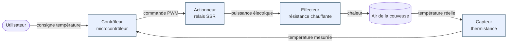

# Schéma bloc fonctionnel

Le schéma bloc fonctionnel est une **représentation graphique** d'un système mécatronique qui montre ses **sous-fonctions** (capteurs, contrôleurs, actionneurs, effecteurs) et les **flux** d'information, d'énergie et de matière qui circulent entre elles. Il sert de pont entre le cahier des charges et le choix des solutions techniques.

## Pourquoi

Avant de choisir un microcontrôleur, un moteur ou un capteur précis, il faut savoir **quelles fonctions le système doit réaliser et comment elles s'enchaînent**. Le schéma bloc fonctionnel répond à trois questions :

- **Quoi ?** Quelles sous-fonctions composent le système ?
- **Comment ça communique ?** Quels flux (information, énergie, matière) circulent entre les blocs ?
- **Où sont les frontières ?** Qu'est-ce qui appartient au système, qu'est-ce qui est dans son environnement ?

Sans ce schéma, on se retrouve à choisir des composants au hasard sans comprendre leur rôle dans l'ensemble. C'est l'erreur classique : "on a pris un Arduino parce que c'est connu", sans savoir ce qu'on lui demande de faire.

## Comment

Un schéma bloc se construit en partant du **cahier des charges fonctionnel** et en répondant dans l'ordre à :

1. **Quelle est la fonction principale du système ?** → un bloc central, ou la frontière du système.
2. **Quels signaux d'entrée perçoit-il ?** → identifier les **capteurs** (information venant de l'environnement ou de l'utilisateur).
3. **Quelles actions produit-il sur le monde ?** → identifier les **actionneurs** et **effecteurs**.
4. **Qui décide ?** → identifier le ou les **contrôleurs** (microcontrôleur, automate, logique câblée).
5. **Comment circule l'information ?** → tracer les flèches entre les blocs avec le type de flux.

### Conventions de représentation

- **Blocs rectangulaires** : sous-fonctions ou composants.
- **Flèches** : flux entre blocs. Annoter le type : *information* (signal logique, valeur capteur), *énergie* (puissance électrique, mécanique), *matière* (fluide, pièce manipulée).
- **Frontière du système** : pointillé englobant les blocs qui appartiennent au système. Tout ce qui est dehors est environnement.
- **Boucle ouverte vs fermée** : si le contrôleur reçoit un retour mesuré de l'effecteur via un capteur, c'est une boucle **fermée** (asservie). Sinon, boucle **ouverte**.

## Exemple

Projet : régulation de température d'une couveuse à œufs.

On lit le schéma ainsi : l'utilisateur fixe une consigne, le contrôleur la compare à la mesure de la thermistance, et pilote en PWM le relais qui alimente la résistance chauffante. La chaleur diffuse dans l'air, le capteur mesure, **boucle fermée**.

## Pièges

**Confondre actionneur et effecteur.** Le moteur (actionneur) convertit l'énergie électrique en énergie mécanique. La roue (effecteur) applique cette énergie à l'environnement. Les deux sont distincts même s'ils sont souvent regroupés mentalement.

**Mélanger les niveaux d'abstraction.** Un bloc "Arduino Uno" et un bloc "boucle d'asservissement PID" ne sont pas au même niveau. Soit on raisonne en composants matériels, soit en fonctions logicielles, mais pas les deux sur le même schéma.

**Oublier les flux d'énergie.** Beaucoup d'étudiants ne tracent que les fils d'information (signaux logiques) et oublient les flux de puissance. Or l'alimentation d'un actionneur est souvent un point de défaillance critique.

**Vouloir tout mettre.** Un schéma bloc fonctionnel n'est **pas** un schéma électrique. Pas de valeurs de résistances, pas de brochages. Si tu hésites à inclure un détail, c'est probablement qu'il appartient à un autre document.

## Voir aussi

- [[../proj/cahier-des-charges-fonctionnel|Cahier des charges fonctionnel]] — l'entrée du processus, dont découle le schéma bloc.
- [[boucle-ouverte-boucle-fermee|Boucle ouverte / boucle fermée]] — caractérise la nature du contrôle dans le schéma.
- [[capteurs-actionneurs|Capteurs et actionneurs]] — les deux familles de blocs d'interface avec l'environnement.
