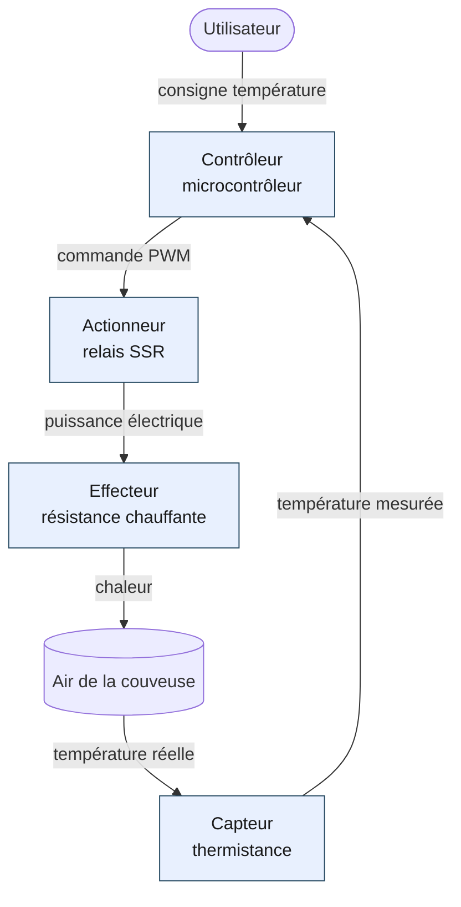

Le **schéma bloc fonctionnel** est une représentation graphique d'un système mécatronique qui montre ses sous-fonctions ([[capteur|capteurs]], [[controleur|contrôleurs]], [[actionneur|actionneurs]], [[effecteur|effecteurs]]) et les flux d'information, d'énergie et de matière qui circulent entre elles. Il sert de pont entre le [[cahier-des-charges-fonctionnel|cahier des charges]] et le choix des solutions techniques.

## À quoi ça sert ?

Avant de choisir un [[microcontroleur]], un moteur ou un capteur précis, il faut savoir quelles fonctions le système doit réaliser et comment elles s'enchaînent. Le schéma bloc fonctionnel répond à trois questions :

- **Quoi ?** Quelles sous-fonctions composent le système ?
- **Comment ça communique ?** Quels flux (information, énergie, matière) circulent entre les blocs ?
- **Où sont les frontières ?** Qu'est-ce qui appartient au système, qu'est-ce qui est dans son environnement ?

Sans ce schéma, on se retrouve à choisir des composants au hasard sans comprendre leur rôle dans l'ensemble. C'est l'erreur classique en début de projet : *"on a pris un Arduino parce que c'est connu"*, sans savoir ce qu'on lui demande de faire. Trois semaines plus tard, l'équipe découvre qu'il manque deux entrées analogiques et une sortie [[pwm|PWM]] : refonte complète du câblage, deux jours perdus.

Le schéma bloc joue un autre rôle décisif : c'est un document de communication. Il s'échange entre membres de l'équipe, se discute avec l'encadrant, se présente en revue de projet. Un schéma clair fait gagner des heures de malentendus.

## Comment le réaliser ?

Un schéma bloc se construit en partant du [[cahier-des-charges-fonctionnel|cahier des charges fonctionnel]] et en répondant dans l'ordre à cinq questions :

1. Quelle est la fonction principale du système ? → un bloc central, ou la [[frontiere-systeme|frontière du système]].
2. Quels signaux d'entrée perçoit-il ? → identifier les [[capteur|capteurs]] (information venant de l'environnement ou de l'utilisateur).
3. Quelles actions produit-il sur le monde ? → identifier les [[actionneur|actionneurs]] et [[effecteur|effecteurs]].
4. Qui décide ? → identifier le ou les [[controleur|contrôleurs]] (microcontrôleur, automate, logique câblée).
5. Comment circule l'information ? → tracer les flèches entre les blocs avec le type de flux.

L'ordre compte : commencer par le contrôleur est un piège fréquent qui mène à dimensionner le système autour d'un composant plutôt qu'autour d'un besoin. *"Je connais bien les ESP32, je vais partir là-dessus"* — et l'on se retrouve à devoir caser l'usage dans les contraintes du composant.

### Conventions de représentation

- **Blocs rectangulaires** : sous-fonctions ou composants. Un nom de fonction (verbe à l'infinitif) plutôt qu'un nom de produit.
- **Flèches** : flux entre blocs. Annoter le type :
  - *Information* : signal logique, valeur capteur, message réseau. Trait fin par convention.
  - *Énergie* : puissance électrique, mécanique, hydraulique. Trait épais ou flèche double.
  - *Matière* : fluide, pièce manipulée, échantillon. Trait pointillé ou flèche pleine large.
- **[[frontiere-systeme|Frontière du système]]** : pointillé englobant les blocs qui appartiennent au système. Tout ce qui est dehors est environnement (utilisateur, objet à manipuler, conditions extérieures).
- **[[boucle-ouverte-boucle-fermee|Boucle ouverte vs fermée]]** : si le contrôleur reçoit un retour mesuré de l'effecteur via un capteur, c'est une boucle fermée (asservie). Sinon, boucle ouverte.

<!-- TODO: insérer ici un schéma d'illustration des conventions (légende des flèches, blocs types). -->

## Exemple

Projet : régulation de température d'une couveuse à œufs.

On lit le schéma ainsi : l'utilisateur fixe une consigne, le contrôleur la compare à la mesure de la thermistance, et pilote en [[pwm|PWM]] le relais qui alimente la résistance chauffante. La chaleur diffuse dans l'air de la couveuse, le capteur mesure, [[boucle-ouverte-boucle-fermee|boucle fermée]].

Quelques observations à tirer de cet exemple :

- L'utilisateur et l'air de la couveuse sont en dehors du système (pas dans la frontière colorée). Ce sont des éléments d'environnement.
- L'effecteur (résistance chauffante) est distinct de l'actionneur (relais SSR). Le relais commute la puissance ; la résistance la transforme en chaleur.
- La boucle se ferme par le monde physique : la chaleur passe par l'air avant d'être mesurée. C'est typique des systèmes thermiques, et ça explique l'inertie longue caractéristique de ce type d'[[asservissement]] (un correcteur [[pid|PID]] est généralement nécessaire pour atteindre une régulation stable).

<!-- TODO: ajouter une photo de couveuse réelle annotée avec les blocs identifiés. -->

## Pièges

**Confondre actionneur et effecteur.** Le moteur (actionneur) convertit l'énergie électrique en énergie mécanique. La roue (effecteur) applique cette énergie à l'environnement. Les deux sont distincts même s'ils sont souvent regroupés mentalement. La distinction devient critique quand l'effecteur change (roue motrice vs chenille vs hélice) et que l'actionneur reste le même.

**Mélanger les niveaux d'abstraction.** Un bloc "Arduino Uno" et un bloc "boucle d'asservissement PID" ne sont pas au même niveau. Soit on raisonne en composants matériels, soit en fonctions logicielles, mais pas les deux sur le même schéma. Si le mélange est nécessaire, faire deux schémas distincts qui se référencent.

**Oublier les flux d'énergie.** Beaucoup d'étudiants ne tracent que les fils d'information (signaux logiques) et oublient les flux de puissance. Or l'alimentation d'un actionneur est souvent un point de défaillance critique : courant trop faible, masse mal câblée, isolation insuffisante.

**Vouloir tout mettre.** Un schéma bloc fonctionnel n'est pas un schéma électrique. Pas de valeurs de résistances, pas de brochages, pas de références de composants. Si tu hésites à inclure un détail, c'est probablement qu'il appartient à un autre document (schéma électrique, nomenclature, dossier de fabrication).

**Confondre frontière du système et frontière du PCB.** Le système inclut souvent des éléments mécaniques (effecteurs), des liaisons (câbles, tuyaux), parfois un boîtier. La carte électronique n'est qu'une partie du système.

## Voir aussi

- [[../proj/decomposition-fonctionnelle|Décomposition fonctionnelle]] — analyse amont côté gestion de projet, qui produit les fonctions techniques que ce schéma vient concrétiser en blocs matériels.
- [[../proj/cahier-des-charges-fonctionnel|Cahier des charges fonctionnel]] — l'entrée du processus, dont découle le schéma bloc.
- [[boucle-ouverte-boucle-fermee|Boucle ouverte / boucle fermée]] — caractérise la nature du contrôle dans le schéma.
- [[capteur|Capteurs]] et [[actionneur|actionneurs]] — les deux familles de blocs d'interface avec l'environnement.
