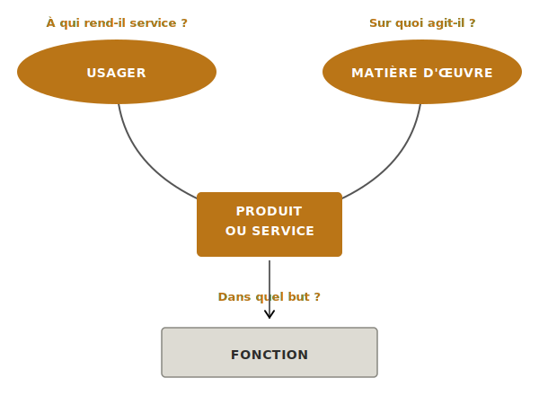
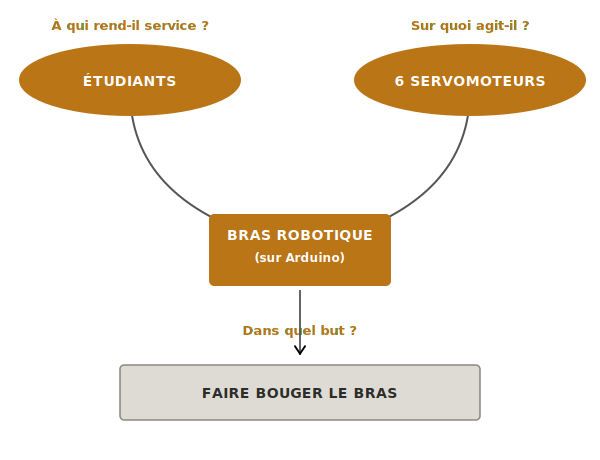
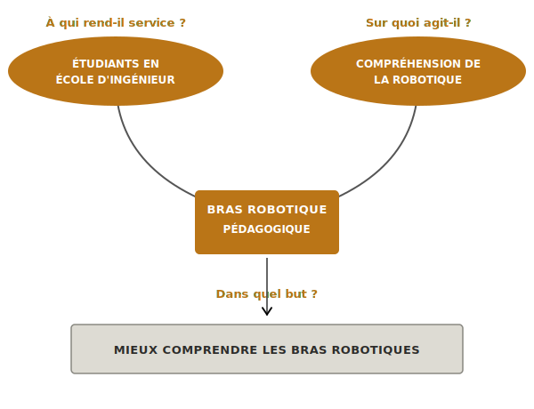
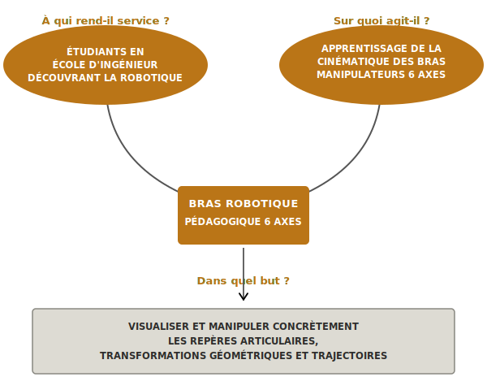

La **bête à cornes** est un outil graphique d'analyse fonctionnelle qui formule un besoin en trois questions : à qui le système rend-il service, sur quoi agit-il, et dans quel but. Issue de la méthode [[afnor-nfx50-151|NF X50-151]], elle ouvre la [[specification-technique|phase de spécification]] et fixe ce qui sera ensuite chiffré dans le [[cahier-des-charges-fonctionnel|cahier des charges fonctionnel]].

## À quoi ça sert ?

Trois questions, trois réponses : la bête à cornes paraît dérisoire. Sa puissance tient à ce qu'elle **oblige à expliciter** ce qu'on croit évident. Le moment où deux équipiers répondent différemment au « à qui » est exactement le moment où l'outil gagne son utilité — un désaccord qui serait apparu trois mois plus tard, sur un livrable terminé, devient une discussion de cinq minutes en amont.

Elle joue trois rôles :

- **Cadrer** le périmètre du projet en distinguant utilisateur, matière d'œuvre et service rendu
- **Vérifier** qu'on parle bien d'un **besoin** et non d'une solution déjà choisie
- **Servir de référence** tout au long du projet : si une décision technique s'éloigne du « but » formulé ici, c'est un signal d'alerte

## Comment la construire ?

La bête à cornes répond à trois questions, dans cet ordre :

| Question | Ce qu'elle désigne |
|---|---|
| **À qui le système rend-il service ?** | L'utilisateur, le bénéficiaire — pas l'acheteur ni le client au sens commercial |
| **Sur quoi agit-il ?** | La matière d'œuvre : objet, information, milieu, processus que le système transforme |
| **Dans quel but ?** | Le service rendu, formulé sans préjuger de la solution |

Le schéma classique relie ces trois éléments au système placé au centre :

### Méthode de remplissage

1. **Commencer par "à qui"** — qui utilise réellement le système ? Pas "tout le monde". Si plusieurs profils, choisir l'utilisateur principal et noter les autres comme parties prenantes secondaires.
2. **Identifier "sur quoi"** — quel objet, milieu ou information est transformé par le système ? Si la réponse est "rien", la bête à cornes ne convient pas (revoir la formulation du projet).
3. **Formuler "dans quel but"** — répondre à la question « pourquoi cet utilisateur a-t-il besoin de ce système ? ». Le but énonce un **service** ou une **finalité**, jamais un mécanisme.
4. **Relire à voix haute** : *« Ce système rend service à [qui] en agissant sur [quoi] dans le but de [but] »*. La phrase doit sonner juste et être comprise sans glose.

## Exemple — Bras robotique pédagogique 6 axes

Un projet de bras robotique destiné à être déployé dans des écoles d'ingénieurs pour soutenir l'enseignement de la cinématique des manipulateurs.

> [!failure] Mauvais
> 
>
> **Pourquoi c'est mauvais.** « 6 servomoteurs » et « Arduino » sont des choix de solution — la bête à cornes doit rester agnostique de l'implémentation. « Faire bouger » n'est pas un but, c'est une fonction technique. Le besoin pédagogique, raison d'être du projet, a disparu.
>
> **Coût réel de cette erreur.** Sur ce projet, l'équipe a tenu cette formulation deux mois avant de revenir en arrière : les servomoteurs choisis trop tôt se sont révélés inadaptés aux exigences réelles du bras, l'équipe a dû basculer sur des moteurs pas-à-pas. Deux mois de dimensionnement, de soudures et de code à refaire — erreur qui aurait été évitée si la bête à cornes n'avait pas verrouillé la technologie d'actionneur dès la phase de spec.

> [!warning] Moyen
> 
>
> **Pourquoi c'est moyen.** Le public est ciblé, la posture besoin (et non solution) est respectée. Mais « mieux comprendre les bras robotiques » est trop vague pour être évaluable — comprendre quoi exactement ? « Compréhension de la robotique » comme matière d'œuvre est imprécis : le système agit sur l'**apprentissage** de l'étudiant, pas sur la robotique en tant que discipline.

> [!example] Bon
> 
>
> **Pourquoi c'est bon.** La cible est précisée (découverte, pas perfectionnement), la matière d'œuvre est un apprentissage circonscrit à un objet précis, et le but énonce les compétences visées sans rien décider de l'implémentation. Un simulateur logiciel, un bras physique, un Arduino ou un STM32 sont toutes des solutions encore ouvertes à ce stade — c'est exactement ce qu'on veut.

## Pièges

**Confondre besoin et solution.** Si une réponse contient un nom de composant, une technologie ou un protocole, la bête à cornes n'est pas finie. Reformuler en remontant d'un niveau d'abstraction.

**"Tout le monde" comme utilisateur.** Quand on ne sait pas à qui le système rend service, on n'a pas encore défini le projet. Forcer un choix, même imparfait — il sera affiné après l'analyse des parties prenantes.

**But sous forme de fonction technique.** « Mesurer la température », « afficher des données », « commander un moteur » sont des fonctions, pas des buts. Le but répond à *pourquoi* on mesure, affiche ou commande — pas à *quoi* le système fait.

**Matière d'œuvre absente ou floue.** Si la case « sur quoi » est vide ou très vague, le système n'a probablement pas de raison d'être claire. C'est un signal pour revenir à l'analyse du besoin avant d'avancer.

**Formulation jolie mais vide.** « Améliorer l'expérience utilisateur », « optimiser les performances » : tout projet pourrait afficher ce but. S'il s'applique à n'importe quel projet, il ne dit rien sur le vôtre.

## Cas particulier — projet école sans client réel

Quand le projet n'a pas de client externe (robot sumo, robot suiveur de ligne, démonstrateur démonté après soutenance), la bête à cornes paraît tourner à vide. Deux postures honnêtes existent, voir le [[specification-technique#cas-particulier-projet-école-sans-client-réel|cas particulier de la phase de spécification]] pour le détail. L'essentiel : choisir explicitement une posture et la tenir.

## Voir aussi

- [[specification-technique|Spécification technique]] — phase où s'insère la bête à cornes
- [[cahier-des-charges-fonctionnel|Cahier des charges fonctionnel]] — document final qui chiffre les besoins exprimés ici
- [[afnor-nfx50-151|Norme NF X50-151]] — cadre méthodologique
