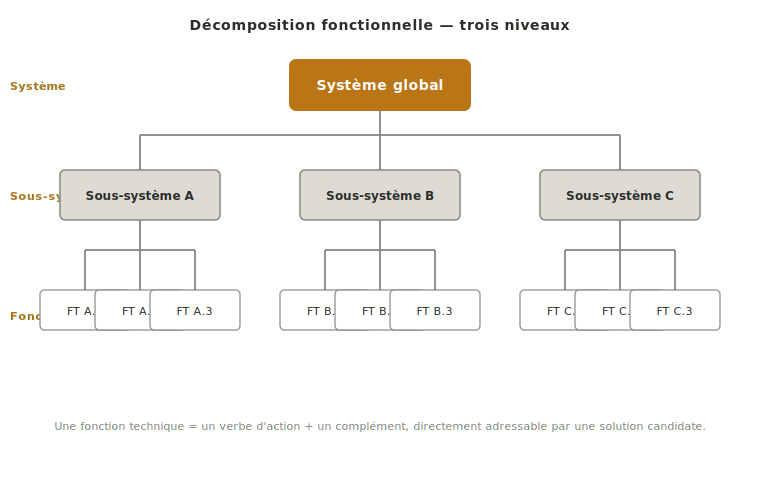
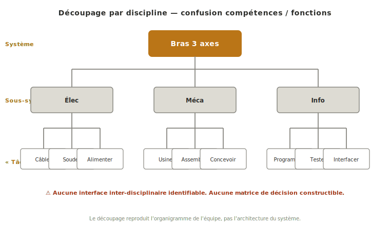
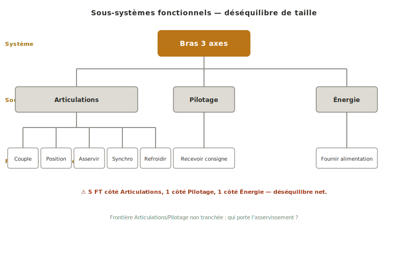
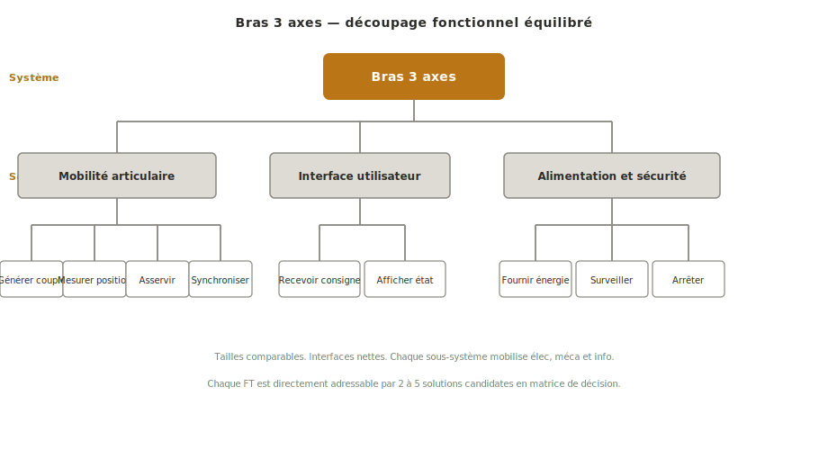

La **décomposition fonctionnelle** est une analyse descendante qui découpe un système en sous-systèmes cohérents, puis chaque sous-système en fonctions techniques internes, à partir des fonctions de service énoncées au [[cahier-des-charges-fonctionnel|cahier des charges fonctionnel]]. Elle ouvre la [[concept|phase de concept]] en faisant passer le projet d'une vue externe — *ce que le système rend comme service* — à une vue interne — *comment il s'organise pour le rendre*.

## À quoi ça sert ?

Le [[cahier-des-charges-fonctionnel|CdCF]] arrête le *quoi* du projet. La décomposition fonctionnelle ouvre le *comment* en regardant pour la première fois **l'intérieur du système**. On identifie les blocs internes traçables, et pour chaque bloc les fonctions techniques qui réaliseront sa part des fonctions de service. C'est la passerelle entre l'analyse fonctionnelle externe (fonctions de service issues de la [[pieuvre|pieuvre]]) et l'exploration des solutions techniques par discipline qui suivra.

L'outil joue trois rôles indissociables :

- **Structurer le travail en équipe** en produisant des sous-systèmes aux interfaces nettes, que chaque discipline (élec, méca, info) peut s'approprier sans bloquer les autres
- **Préparer l'exploration des solutions** en ramenant le système à des fonctions techniques élémentaires, chacune confrontable à 2-5 solutions candidates dans une [[matrice-de-decision|matrice de décision]]
- **Révéler les trous du CdCF** — c'est la première fois qu'on regarde le système de l'intérieur, et les [[fonction|fonctions de service]] oubliées remontent presque toujours à ce moment-là

Le découpage produit ici n'est pas figé pour autant. L'exploration des solutions à l'étape suivante peut révéler qu'un bloc doit être scindé (deux logiques de commande très différentes coexistent) ou fusionné (deux blocs partagent en fait la même structure). On revient corriger sans état d'âme.

## Comment décomposer le système ?

La décomposition se mène en deux passes successives : du système global aux **sous-systèmes** cohérents, puis de chaque sous-système aux **fonctions techniques** internes. Le résultat se représente naturellement en arborescence descendante, racine en haut.

### Du système aux sous-systèmes

À la racine, le système global. À la première descente, **3 à 5 sous-systèmes** qui, assemblés, réalisent l'ensemble des fonctions de service énoncées au CdCF. Plus que 5 : le découpage est trop fin pour ce niveau, on a déjà commencé à entrer dans les fonctions techniques. Moins que 2 : le système n'est pas décomposé, il est seulement renommé.

Trois critères de bon découpage :

- **Interfaces nettes** — pour chaque sous-système, on doit pouvoir énumérer les flux qui entrent et sortent (énergie, information, matière). Si une frontière est floue, le découpage l'est aussi, et la suite du projet en payera le prix.
- **Autonomie technique** — un sous-système doit pouvoir être pris en charge par une équipe restreinte sans bloquer les autres sur tout. Test pratique : *deux étudiants peuvent-ils avancer en parallèle sur deux sous-systèmes sans se synchroniser tous les jours ?*
- **Taille comparable** — un sous-système qui pèse à lui seul 80 % du projet a été sous-découpé, ou les autres ont été surévalués. Le déséquilibre est un signal de relecture, pas une fatalité à accepter.

Le découpage **n'est pas une répartition par discipline**. Un bon sous-système mécatronique mobilise généralement élec, méca et info ensemble. Reproduire l'organigramme de l'équipe (« le bloc méca, le bloc info, le bloc élec ») rate la décomposition fonctionnelle : on décompose alors les compétences, pas le système.

### Des sous-systèmes aux fonctions techniques

Sous chaque sous-système, lister les **fonctions techniques internes** qui réalisent sa part des fonctions de service. La formulation suit rigoureusement la convention des [[fonction|fonctions de service]] : **verbe d'action à l'infinitif + complément** (*« mesurer la position angulaire »*, *« convertir l'énergie électrique en mouvement »*).

La distinction conceptuelle est cruciale et souvent confondue :

- Une **fonction de service** (issue de la [[pieuvre|pieuvre]]) dit *ce que le système rend* à l'extérieur. Elle est tournée vers l'usage.
- Une **fonction technique** (issue de la décomposition) dit *comment le système s'y prend* en interne. Elle est tournée vers la réalisation.

Une même fonction de service peut être réalisée par plusieurs combinaisons de fonctions techniques — c'est précisément ce qui ouvre l'espace de solutions exploré à l'étape suivante.

### Où s'arrêter

La règle pratique : **descendre tant que la fonction technique n'est pas directement adressable par une solution candidate, s'arrêter dès qu'elle l'est**. *« Mesurer la position angulaire »* est adressable (capteur de position, encodeur incrémental, potentiomètre…) → on s'arrête. *« Gérer le mouvement »* ne l'est pas (trop vague pour qu'on liste 2-5 solutions concrètes) → on raffine d'un niveau.

En projet école, **2 à 3 niveaux suffisent** dans la majorité des cas : système → sous-systèmes → fonctions techniques. Descendre plus profond, c'est anticiper le [[dossier-technique|dossier technique]] et s'engager prématurément vers un composant — choix qui devrait être fait plus tard, après arbitrage en matrice de décision.

Le découpage se construit en **plusieurs passes**, pas en un jet unique. Premier découpage à haut niveau pour caler la structure générale, puis raffinement au fur et à mesure que l'exploration des solutions fait apparaître des fonctions techniques manquantes ou redondantes. Viser l'exhaustivité au premier coup fait perdre du temps et fige prématurément un découpage qui va de toute façon évoluer.

## Exemple — Bras 3 axes pédagogique

Reprenons le bras robotique pédagogique 3 axes, dont la fonction principale **FP1** énonce : *« permettre à l'opérateur de manipuler le robot pour positionner un objet léger en un point du volume de travail »*. Trois découpages possibles, depuis l'énoncé inutilisable jusqu'à la décomposition directement exploitable à l'étape suivante.

> [!failure] Mauvais
> 
>
> **Pourquoi c'est mauvais.** Le découpage **par discipline** (Élec / Méca / Info) reproduit l'organigramme de l'équipe, pas l'architecture du système. Il dit *qui travaille sur quoi*, pas *comment le système est organisé*. Les interfaces sont indéfinissables : la branche « Élec » ne porte aucune fonction technique tant qu'on ne sait pas quel sous-système elle alimente. Pire, ce découpage **interdit la suite** : impossible de construire une matrice de décision sur « la partie élec » — la matrice opère par fonction technique, pas par discipline.
>
> **Coût réel de cette erreur.** Sur ce projet, l'équipe a travaillé six semaines en silos disciplinaires en croyant suivre la méthode. Au moment de confronter les solutions disciplinaires, personne n'avait défini où passait la limite entre le contrôleur (info) et son alimentation (élec), ni qui spécifiait les engrenages côté méca/élec. Trois semaines supplémentaires pour redécomposer correctement et reprendre les arbitrages de l'étape 2.

> [!warning] Moyen
> 
>
> **Pourquoi c'est moyen.** Les sous-systèmes sont bien fonctionnels (*Articulations*, *Pilotage*, *Énergie*) et chacun mobilise plusieurs disciplines — ce qui constitue déjà un net progrès sur la version disciplinaire. Mais le découpage souffre de deux faiblesses persistantes. **Déséquilibre de taille** : *Articulations* concentre l'essentiel de la matière technique (génération du couple, mesure de position, asservissement, synchronisation des trois axes), tandis qu'*Énergie* se réduit à *« fournir l'alimentation »*. **Interfaces incomplètement décrites** : la frontière entre *Articulations* et *Pilotage* n'est pas tranchée — la boucle d'asservissement traverse les deux blocs, qui en porte la responsabilité ? Tant que la frontière n'est pas explicitée, deux étudiants travaillant en parallèle sur ces deux sous-systèmes ne peuvent pas avancer indépendamment.

> [!example] Bon
> 
>
> **Pourquoi c'est bon.** Le découpage en **mobilité articulaire / interface utilisateur / alimentation et sécurité** respecte les trois critères du bon découpage. Tailles comparables : chaque sous-système porte 3 à 4 fonctions techniques internes d'effort similaire. Interfaces nettes : *mobilité articulaire* reçoit une consigne de position depuis *interface utilisateur* et une puissance régulée depuis *alimentation et sécurité*, et renvoie une position mesurée. Chacun mobilise élec, méca et info — il n'y a pas de bloc mono-disciplinaire. Les fonctions techniques sont chacune directement adressables par une solution candidate : *« générer un couple sur chaque axe »* appelle 2-5 candidats (servomoteur, moteur pas-à-pas, moteur DC + réducteur…) confrontables en [[matrice-de-decision|matrice de décision]]. Le découpage prépare directement l'étape 2 du concept.

## Pièges

**Découper par discipline.** Le piège le plus fréquent en projet école : reproduire les compétences de l'équipe (méca / élec / info) au lieu de la fonction du système. Reformuler les blocs en fonctions du système (*« mettre en mouvement »*, *« réguler l'énergie »*) — chacun mobilisera plusieurs disciplines, c'est précisément ce qu'on attend d'un sous-système mécatronique.

**Sauter directement aux composants.** Écrire *« moteur pas-à-pas »* ou *« ESP32 »* dans l'arborescence est une erreur de niveau d'abstraction. À ce stade, on ne décide ni des solutions, ni des composants — on identifie *quelles fonctions* doivent être réalisées. Les composants viendront en [[dossier-technique|dossier technique]] après arbitrage par [[matrice-de-decision|matrice de décision]].

**Confondre fonction de service et fonction technique.** Réécrire dans l'arborescence les FP/FS du [[cahier-des-charges-fonctionnel|CdCF]] revient à n'avoir rien décomposé. Test rapide : *cette fonction est-elle tournée vers l'extérieur (service rendu) ou vers l'intérieur (réalisation interne) ?* Si elle pourrait apparaître dans la [[pieuvre|pieuvre]], c'est une fonction de service — la décomposition doit produire autre chose.

**Descendre trop profond.** Une arborescence à 5-6 niveaux est généralement le signe qu'on a anticipé le dossier technique. Si la dernière feuille ressemble à un sous-composant déterminé (*« choisir le condensateur de filtrage »*), on a dépassé la cible. Remonter à un niveau où la feuille est *« filtrer la tension d'alimentation »* — adressable, mais pas verrouillée sur une solution.

**Déséquilibre de taille toléré.** Un sous-système qui concentre la majeure partie de la matière technique mérite d'être scindé. Le déséquilibre est un signal de relecture, pas une fatalité : soit le bloc a été défini trop large, soit les autres ont été sous-décomposés. Dans les deux cas, reprendre.

**Décomposer une seule fois et figer.** Le découpage évolue avec l'exploration des solutions. Une fonction technique qui paraissait isolée peut se révéler indispensable à deux sous-systèmes ; deux fonctions distinctes peuvent partager la même solution candidate. Reprendre la décomposition à chaque révélation, plutôt qu'empiler des correctifs en marge.

## Cas particulier — reconception et reverse engineering

Quand le projet est une **reconception** d'un système existant (refonte d'un démonstrateur école, mise à jour d'un produit interne) ou une analyse fonctionnelle à partir d'un objet déjà fabriqué (*reverse engineering* pédagogique), la décomposition s'inverse : on part du système matériel observable et on remonte aux fonctions techniques qu'il réalise, puis aux fonctions de service qu'il rend.

L'exercice reste utile, avec deux précautions :

- **Ne pas confondre composants observables et fonctions techniques.** Un servomoteur visible dans l'objet ne *fait* pas la décomposition : il *réalise* une fonction technique qu'il faut nommer explicitement (*« générer un couple sur l'axe »*). Le passage par la formulation verbe + complément reste impératif, même quand le composant est sous les yeux.
- **Comparer la décomposition obtenue au CdCF cible.** Si le projet est une reconception, le CdCF cible peut différer du CdCF de l'objet d'origine. La décomposition fonctionnelle de l'existant sert alors de point de départ, pas de référence à reproduire à l'identique — l'arbitrage des écarts est précisément ce que la nouvelle phase de concept doit trancher.

## Voir aussi

- [[concept|Concept]] — phase où s'insère la décomposition fonctionnelle (étape 1)
- [[cahier-des-charges-fonctionnel|Cahier des charges fonctionnel]] — entrée amont, source des fonctions de service à réaliser
- [[fonction|Fonction]] — typologie FP/FS/FC dont les fonctions de service servent de racines à la décomposition
- [[fast|FAST]] — formalisation approfondie d'une branche de la décomposition par chaîne logique *POURQUOI / COMMENT*
- [[schema-bloc-fonctionnel|Schéma bloc fonctionnel]] — vue aval côté élec/info, qui concrétise les fonctions techniques en blocs matériels et flux
- [[matrice-de-decision|Matrice de décision]] — outil aval qui arbitre entre solutions candidates pour chaque fonction technique
