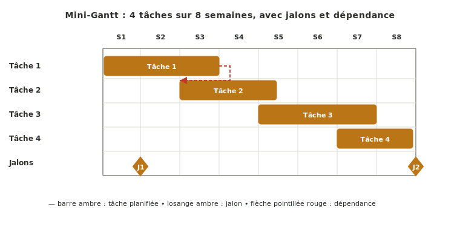
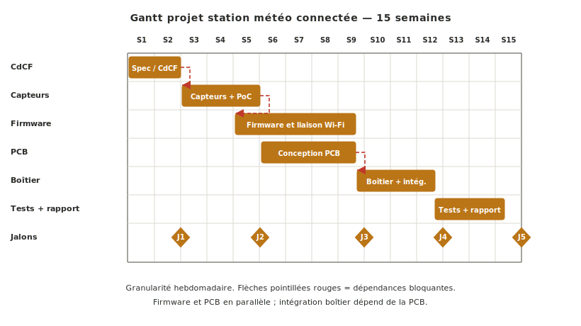

Le **Gantt** (ou diagramme de Gantt) est l'outil graphique qui matérialise un [[retroplanning|rétroplanning]] : tâches en lignes, calendrier en colonnes, barres horizontales qui montrent durées et chevauchements. Sa force pédagogique tient à ce qu'il fait apparaître visuellement les **dépendances** entre tâches et les **goulots** où plusieurs tâches se chevauchent dangereusement.

## À quoi ça sert ?

Le Gantt rend visible d'un coup d'œil l'enchaînement temporel d'un projet. Là où un [[wbs|WBS]] dit *quoi* et un [[retroplanning|rétroplanning]] dit *quand*, le Gantt **les superpose** sur un même support graphique. C'est ce qui permet de voir, au lieu de lire.

Trois rôles :

- **Visualiser les dépendances critiques** entre tâches — telle tâche bloquée par une autre, telle livraison qui conditionne le démarrage d'une suivante. Les flèches de dépendance sont ce qui distingue un Gantt d'une simple liste plantée dans le temps.
- **Repérer les goulots calendaires** où plusieurs tâches se chevauchent dangereusement. Si trois tâches critiques tombent la même semaine, on le voit avant que la semaine arrive.
- **Servir de support de communication en revue.** Jalons et tâches sont lisibles par un lecteur extérieur (encadrant, client) sans contexte préalable — utile dès qu'il faut présenter l'état du projet.

## Comment le construire ?

Cinq étapes :

1. **Reprendre la liste des tâches du [[wbs|WBS]]** et leur durée estimée.
2. **Poser les [[jalons|jalons]] sur l'axe du temps en colonnes** comme points fixes.
3. **Tracer une barre horizontale par tâche** entre sa date de début et sa date de fin.
4. **Ajouter les dépendances** sous forme de flèches reliant les tâches qui s'enchaînent obligatoirement.
5. **Actualiser à chaque revue de phase** — sans cela, le Gantt ment dès la première dérive.

Côté outils, trois options principales sont mobilisables : **Excel ou papier** (rapides à mettre en place, suffisants pour un Gantt simple), **GanttProject** (logiciel libre dédié, gère proprement les dépendances), **Trello** (en ligne, pratique pour combiner suivi WBS et Gantt simplifié via plugins). Choisir un outil et s'y tenir — éparpiller la planification entre trois supports désynchronisés est pire qu'un outil imparfait.

*Illustration sur un cas concret : Gantt d'un projet de station météo connectée sur 15 semaines.*

## Pièges

**Gantt figé après sa production.** Un Gantt produit en début de phase et jamais rouvert ment dès la première dérive. À l'inverse, un Gantt actualisé chaque semaine, même imparfait, devient un outil de pilotage puissant : il révèle les dérives tôt, quand on peut encore agir.

**Trop fin.** Un Gantt à la journée pour un projet de plusieurs mois devient illisible et démoralisant — chaque retard de quelques jours apparaît comme une crise. Granularité à la semaine suffit en projet école.

**Pas de dépendances visibles.** Un Gantt sans flèches de dépendance est juste une liste de tâches plantées dans le temps. L'intérêt pédagogique tient précisément à ce qu'il montre **qui bloque qui** — un retard sur la commande PCB peut décaler trois tâches d'intégration.

## Voir aussi

- [[specification-technique|Spécification technique]] — étape 5 où le Gantt du projet est construit
- [[retroplanning|Rétroplanning]] — planification temporelle que le Gantt matérialise
- [[wbs|WBS]] — décomposition du travail dont les feuilles deviennent les barres du Gantt
- [[jalons|Jalons]] — points fixes posés sur le Gantt avant les tâches
- [[gestion-de-projet|Gestion de projet]] — fil transverse qui maintient le Gantt vivant
