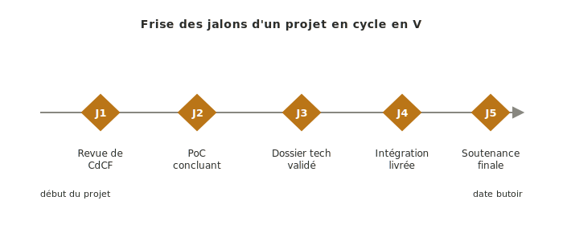
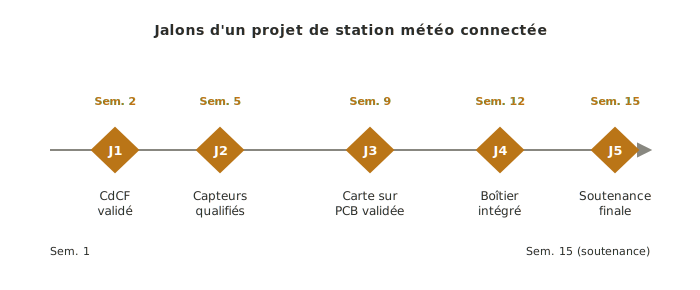

Les **jalons** sont les points de validation qui rythment un projet : ils marquent la transition entre deux phases et **conditionnent le passage** à la suite. Un jalon raté ne se rattrape pas en travaillant plus la semaine suivante — il décale tout l'aval.

## À quoi ça sert ?

Les jalons sortent l'avancement du projet de l'implicite. Plutôt que d'avancer en continu jusqu'à la soutenance — où on découvrirait tard qu'il manque telle ou telle pièce — ils imposent des **points d'arrêt explicites** où l'équipe vérifie qu'elle a bien produit ce qu'il fallait avant de passer à la suite.

Trois rôles indissociables :

- **Acter formellement la fin d'une phase** et autoriser le passage à la suivante. Un jalon validé engage le projet ; un jalon raté force soit le rattrapage, soit la renégociation du périmètre.
- **Imposer un rendez-vous de validation** (revue de CdCF, soutenance de PoC, présentation d'intégration) qui résiste à la dérive du *« on continue, on verra »*.
- **Servir d'ancres temporelles** au [[retroplanning|rétroplanning]] et au [[gantt|Gantt]] : le calendrier projet se construit autour des jalons, pas l'inverse.

## Comment les poser ?

Trois temps :

1. **Identifier les transitions de phase du projet.** Pour un projet en cycle en V, les jalons naturels sont la revue de CdCF, le PoC concluant, le dossier technique validé, l'intégration livrée et la soutenance finale. C'est l'ossature minimale ; on peut en ajouter de plus fins selon les enjeux du projet.
2. **Caler les jalons sur le calendrier** par [[retroplanning|rétroplanning]] depuis la date butoir. Les jalons sont les points fixes ; les tâches du [[wbs|WBS]] s'inscrivent entre eux.
3. **Associer à chaque jalon un livrable précis et un mode de validation** (revue d'équipe, démo, document soumis pour relecture). Le critère doit rendre le jalon binaire — passé / non-passé — pas un objectif flou qu'on évaluera à l'œil le jour venu.

*Illustration sur un cas concret : projet de station météo connectée sur 15 semaines.*

## Pièges

**Jalon sans critère de validation explicite.** Un jalon *« PoC fait »* est inutilisable : qui en juge, sur quels critères ? Un jalon *« PoC démontrant la synchronisation des 3 axes en charge nominale »* est validable. Le critère se pose en même temps que le jalon, pas après.

**Trop de jalons.** Quatre à six jalons majeurs suffisent en projet école. Au-delà, le rituel s'use et perd son effet de seuil — chaque jalon devient une étape parmi d'autres, plus un vrai point d'arrêt qui engage la suite.

**Confondre jalon et échéance interne.** La livraison d'une sous-tâche par un équipier à un autre n'est pas un jalon, c'est une dépendance interne. Un jalon engage la **bascule de phase du projet entier**, avec validation extérieure (encadrant, client).

## Voir aussi

- [[specification-technique|Spécification technique]] — étape 5 où les jalons du projet sont posés
- [[gestion-de-projet|Gestion de projet]] — fil transverse qui maintient les jalons vivants tout au long du projet
- [[retroplanning|Rétroplanning]] — planification à rebours qui s'appuie sur les jalons comme ancres temporelles
- [[gantt|Gantt]] — outil graphique qui matérialise les jalons sur le calendrier
- [[wbs|WBS]] — décomposition du projet en tâches positionnées entre les jalons
