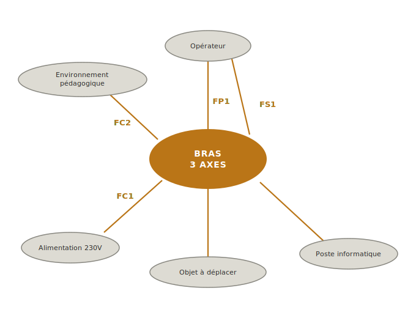

<!-- STUB — à approfondir en session dédiée, au standard de bete-a-cornes.md
(développement de chaque section, exemples enrichis, pièges étoffés). Voir TODO. -->

La **pieuvre** est l'outil graphique d'[[afnor-nfx50-151|analyse fonctionnelle]] qui formalise *ce que le système doit faire* en le reliant aux **milieux environnants** avec lesquels il interagit. Chaque lien tracé est une [[fonction|fonction]] ([[FP|principale]], [[FS|secondaire]] ou [[FC|contrainte]]) qui sera ensuite chiffrée dans le [[cahier-des-charges-fonctionnel|cahier des charges fonctionnel]].

## À quoi ça sert ?

*[À rédiger — articuler trois rôles : (1) recenser exhaustivement les milieux environnants pour ne rater aucune contrainte d'interface, (2) formaliser les [[fonction|fonctions]] sans dériver vers la solution, (3) servir de matériau direct à la caractérisation chiffrée de l'étape suivante (critère / niveau / flexibilité).]*

## Comment la construire ?

*[À rédiger — méthode en 3 temps : (1) identifier les milieux par mind map autour du système (familles : utilisateurs, matière d'œuvre, énergies, environnement physique, réglementaire), (2) tracer les liens et formuler chaque fonction au format verbe + complément (voir [[fonction|fonction]] pour le détail), (3) classer FP / FS / FC et numéroter. Renvoi vers [[caracteriser-une-exigence|caractériser une exigence]] pour la suite.]*

## Exemple — projet bras 3 axes

*[À rédiger — commenter le schéma : 5 milieux identifiés (opérateur, objet à déplacer, poste informatique, alimentation électrique, environnement pédagogique), 4 fonctions énoncées (FP1 entre opérateur et objet, FS1 entre opérateur et poste informatique, FC1 vers l'alimentation, FC2 vers l'environnement pédagogique), articulation avec la posture étudiant-client-de-lui-même actée à l'étape 1 de [[specification-technique|spécification technique]].]*

## Pièges

*[À rédiger — au moins : (1) **Oublier des milieux** (réglementation, environnement physique, énergie sont les plus souvent zappés). (2) **Énoncer une solution au lieu d'un besoin** — voir [[fonction|fonction]] pour le test sec. (3) **Mal classer FP/FS/FC** : la topologie du diagramme doit refléter la sémantique (FP/FS traversent le système entre deux milieux, FC ne touche qu'un seul milieu).]*

## Voir aussi

- [[specification-technique|Spécification technique]] — phase où s'insère la pieuvre
- [[fonction|Fonction]] — typologie FP/FS/FC et format d'énoncé
- [[bete-a-cornes|Bête à cornes]] — outil amont qui formule le besoin
- [[caracteriser-une-exigence|Caractériser une exigence]] — étape aval qui chiffre chaque fonction
- [[cahier-des-charges-fonctionnel|Cahier des charges fonctionnel]] — document final qui agrège la pieuvre et les fonctions caractérisées
- [[afnor-nfx50-151|Norme NF X50-151]] — cadre méthodologique
