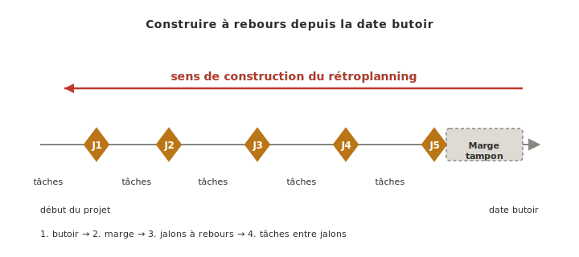
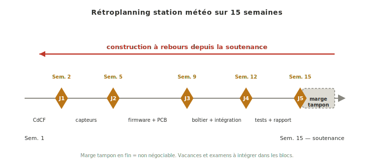

Le **rétroplanning** est la technique de planification à rebours : on part de la date butoir (soutenance, livraison finale) et on remonte le temps en posant d'abord les [[jalons|jalons]] de fin de phase, puis en inscrivant les tâches du [[wbs|WBS]] entre ces jalons. C'est la méthode adaptée aux projets à **date de fin imposée** — typiquement les projets école, où le calendrier scolaire fixe la soutenance.

## À quoi ça sert ?

Le rétroplanning rend la contrainte calendaire opérante dès le début du projet, plutôt que de la subir à la fin. En projet école, la date butoir n'est pas négociable (calendrier de soutenance, fenêtres d'examens). Planifier en partant d'aujourd'hui pour estimer une date d'arrivée n'a pas de sens : on planifie en partant de la date d'arrivée connue pour remonter à aujourd'hui.

Trois rôles :

- **Faire émerger la marge tampon réaliste** en fin de projet (finalisation rapport, répétition soutenance). Un projet calé bout à bout jusqu'à la veille n'a aucune marge — la première dérive le fait déborder.
- **Révéler tôt les phases sur-chargées** qui ne tiennent pas dans le calendrier disponible. Mieux vaut constater le manque de temps en début de projet, quand on peut renégocier le périmètre, qu'au moment d'y faire face.
- **Servir de support de pilotage continu.** Le rétroplanning n'est pas un livrable d'ouverture qu'on archive : il se relit à chaque revue de phase et se met à jour à chaque dérive.

## Comment le construire ?

Cinq étapes, dans l'ordre :

1. **Poser la date butoir** (soutenance, livraison finale) comme point d'ancrage.
2. **Réserver une marge tampon avant la butoir**, dédiée à la finalisation du rapport et à la répétition de la soutenance. Cette marge est non négociable — elle n'absorbe pas du travail technique, elle absorbe les imprévus.
3. **Poser les [[jalons|jalons]] de fin de phase à rebours**, en allouant à chaque phase une durée plausible compte tenu du calendrier scolaire.
4. **Inscrire les tâches du [[wbs|WBS]] entre les jalons**, en repérant les dépendances (telle tâche en attend une autre) et les goulots (telle semaine concentre trop de travail en parallèle).
5. **Confronter au calendrier réel** : vacances, examens, indisponibilité fablab en période de partiels, stages. Ces contraintes ne sont pas négociables — les intégrer dès la pose du rétroplanning, pas après. Matérialiser ensuite l'ensemble en [[gantt|Gantt]].

*Illustration sur un cas concret : rétroplanning d'un projet de station météo connectée sur 15 semaines.*

## Pièges

**Pas de marge tampon en fin.** Le rétroplanning naïf cale les tâches bout à bout jusqu'à la veille de la soutenance. Il suffit d'un imprévu — et il y en a toujours — pour que tout déborde. Garder une marge tampon explicite avant la date butoir change la nature du projet : le stress n'est plus systémique mais ponctuel.

**Ignorer les contraintes calendaires réelles.** Un rétroplanning qui ignore les périodes d'examens, les vacances ou les fenêtres d'indisponibilité fablab est faux dès sa production. Mieux vaut découvrir ces contraintes au début, quand on peut adapter, qu'au moment où elles bloquent.

**Rétroplanning figé.** Un rétroplanning qui n'est pas relu à chaque revue de phase ment dès la première dérive. Sa valeur tient à son actualisation — plan vivant, pas document d'archive.

## Voir aussi

- [[specification-technique|Spécification technique]] — étape 5 où le rétroplanning du projet est construit
- [[jalons|Jalons]] — points d'ancrage du rétroplanning (à poser en premier)
- [[wbs|WBS]] — tâches à inscrire entre les jalons
- [[gantt|Gantt]] — outil graphique qui matérialise le rétroplanning
- [[gestion-de-projet|Gestion de projet]] — fil transverse qui actualise le rétroplanning au fil du projet
