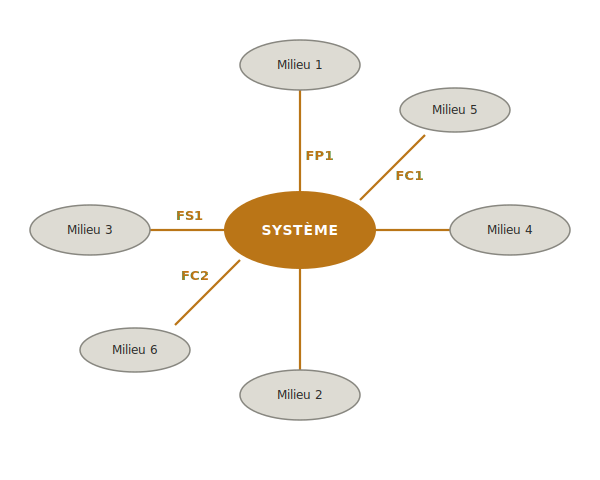

La **spécification technique** est la première phase du projet [[mecatronique|mécatronique]] : elle transforme un besoin formulé en langage courant ("on aimerait un robot qui...") en un document de référence chiffré et opposable — le [[cahier-des-charges-fonctionnel|cahier des charges fonctionnel]]. C'est la phase qui décide *ce qu'on doit faire*, avant tout choix de solution technique.

## Posture attendue

La tentation, à ce stade, est de sauter directement aux composants : "il nous faudrait un ESP32, un capteur de température, un moteur pas-à-pas". Résistez. Cette étape ne demande pas d'imaginer la solution, elle demande de **comprendre le problème**. Plus vous serez précis ici, moins vous reviendrez en arrière plus tard. Un cahier des charges bâclé coûte deux à cinq fois plus cher en temps passé à le corriger à la fin du projet qu'au début.

## Objectif de la phase

Produire un cahier des charges fonctionnel (CdCF) qui :

- formule sans ambiguïté **ce que le système doit faire** (et pas comment)
- chiffre chaque exigence ([[critere|critère]], [[niveau|niveau]], [[flexibilite|flexibilité]])
- intègre les contraintes d'[[ecoconception|écoconception]]
- s'appuie sur un [[etat-de-l-art-technique|état de l'art technique]]
- est validé par le client ou commanditaire du projet

Ce document servira de **référence pendant tout le projet** et de **grille d'évaluation finale** : à la livraison, on reprend le CdCF point par point pour valider ou non chaque exigence.

## Démarche

### 1. Analyser le besoin

Avant tout schéma ou choix de composant, il faut comprendre **ce qu'on cherche vraiment à faire et pour qui**. Cette étape est la plus tentée d'être bâclée, et la plus pénalisante quand elle l'est : un besoin mal compris produit un système qui fonctionne mais qui ne sert à rien.

L'analyse du besoin se mène en trois temps : contextualiser, formuler avec la bête à cornes, valider.

*Selon les projets, une note de cadrage peut être fournie par les enseignants. Dans ce cas, vous ne « découvrez » pas le besoin — vous le **reformulez** pour montrer que vous l'avez compris, et vous le **précisez** sur ce qui n'est pas explicite. La démarche reste la même.*

#### Contextualiser

Le contexte répond à la question : **pourquoi ce projet existe ?**

À traiter dans le rapport :

- **Origine du projet** — qui le demande, pourquoi maintenant, quelle situation initiale le motive
- **Parties prenantes** — qui est concerné (utilisateur final, client, mainteneur, fabricant, voisinage, environnement)
- **Verrous technologiques** — quels obstacles techniques ou scientifiques le projet cherche à dépasser

> [!warning] Attention
> **Verrou technologique ≠ difficulté personnelle.** « Nous n'avons jamais fait de [[pcb|PCB]] » n'est pas un verrou technologique, c'est un manque d'expérience qu'on va combler. Un vrai verrou : « détecter un gaz inflammable avec une concentration < 50 [[ppm|ppm]] avec un composant à moins de 10 € en grande série ». Si votre projet n'a pas de verrou technologique fort, dites-le honnêtement et déplacez l'enjeu ailleurs (intégration système, contraintes industrielles, performances).

#### Formuler le besoin avec la bête à cornes

La [[bete-a-cornes|bête à cornes]] est l'outil canonique de [[afnor-nfx50-151|la norme NF X50-151]] pour exprimer un besoin de manière formelle. Elle force trois réponses :

- **À qui le système rend-il service ?** → l'utilisateur (au sens large)
- **Sur quoi agit-il ?** → la matière d'œuvre, l'objet ou le milieu sur lequel il opère
- **Dans quel but ?** → le service rendu

> [!example] Exemple : projet couveuse
>
> - **À qui** : éleveur amateur en autoconsommation
> - **Sur quoi** : œufs de poule fécondés
> - **But** : assurer le développement embryonnaire jusqu'à l'éclosion sans surveillance permanente

##### Cas particulier : projet école sans client réel

Beaucoup de projets pédagogiques n'ont pas de client externe et seront démontés après soutenance (robot solveur de labyrinthe, robot sumo, etc.). La [[bete-a-cornes|bête à cornes]] paraît alors tourner à vide.

Deux postures honnêtes selon le projet :

- **L'étudiant devient son propre client** : le service rendu est l'acquisition de compétences ciblées (« développer une chaîne d'asservissement, intégrer une carte électronique sur mesure, manipuler une régulation [[pid|PID]] »). Le « à qui » est l'équipe elle-même, le « but » est explicitement pédagogique. C'est défendable en école, **pas en projet professionnel**.
- **L'équipe se donne un client fictif crédible** : pour le robot labyrinthe, on peut imaginer un cas d'usage (« robot d'inspection de canalisations enterrées »). L'analyse fonctionnelle devient cohérente, et l'exercice prend une dimension d'ingénierie réaliste.

Choisissez explicitement l'une des deux postures et tenez-la pendant toute la rédaction du CdCF.

> [!example] Exemple : projet bras 3 axes
> Le projet fil rouge de ce tutoriel — un bras robotique pédagogique 3 axes — relève de la **posture étudiant-client-de-lui-même** : le commanditaire est l'enseignant de mécatronique lui-même, et le service rendu est explicitement pédagogique (un support démontable et reproductible pour enseigner la chaîne d'asservissement complète).
>
> - **À qui** : enseignant de mécatronique souhaitant un support pédagogique réutilisable
> - **Sur quoi** : objets légers (≤ 100 g) à déplacer dans un volume de travail accessible
> - **But** : illustrer une démarche projet mécatronique complète sur un système simple, démontable et reproductible

#### Valider la compréhension du besoin

Une fois la [[bete-a-cornes|bête à cornes]] formulée, **confrontez-la** :

- **Mode sujet ouvert** (besoin construit par l'équipe) : la valider auprès du [[relation-client|client]] réel ou de son représentant. Si la formulation surprend le client, c'est qu'on a mal compris.
- **Mode sujet cadré** (note de cadrage fournie) : la confronter au document. Y a-t-il des éléments du cadrage qui n'apparaissent pas dans la bête à cornes ? Des choix qu'on a faits qui ne sont pas justifiés par le cadrage ?

Cette validation laisse une trace écrite (mail, compte-rendu de réunion, ou section dédiée du CdCF). C'est la preuve que la compréhension est partagée — sans elle, vous travaillez sur des suppositions.

> [!tip] Astuce
> **La bête à cornes paraît triviale, et c'est précisément là sa puissance.** Trois questions, trois réponses : ça semble enfantin. Mais formuler en trois lignes ce qu'on croyait évident révèle les désaccords cachés dans l'équipe ou avec le client. Le moment où deux équipiers répondent différemment au « à qui » est exactement le moment où l'outil paye son utilité.

> [!livrable] Livrables 1/6 — Spécification technique
> - Texte de contextualisation du projet (origine, parties prenantes, verrous technologiques)
> - Schéma de la [[bete-a-cornes|bête à cornes]] du projet
> - Trace écrite de validation du besoin (mail, compte-rendu de réunion, ou section dédiée du CdCF)

---

### 2. Étudier l'existant

Avant de chiffrer ce que votre système doit faire, regardez ce qui existe déjà. Personne ne conçoit dans le vide : pour presque tout projet mécatronique, des solutions commerciales, des projets open source ou des projets école antérieurs ont déjà réalisé un projet similaire. Les étudier permet d'identifier des briques réutilisables, de calibrer les ordres de grandeur réalistes, et d'éviter de réinventer ce qui marche déjà.

Ce travail produit un **[[etat-de-l-art-technique|état de l'art technique]]** : une comparaison chiffrée de solutions existantes selon des critères choisis. Il se mène en trois temps : recenser les solutions, définir les critères, comparer et conclure.

> [!warning] Attention
> **État de l'art technique ≠ revue bibliographique.** La revue bibliographique consiste à lire (articles, datasheets, normes, livres) et à produire des notes. L'état de l'art technique consiste à recenser ce qui existe et qui marche, et à produire une **comparaison chiffrée orientée décision**. Les deux se nourrissent — la biblio fournit la matière — mais ce n'est pas le même livrable. Un état de l'art qui n'est qu'une liste d'articles lus n'est pas un état de l'art.

#### Recenser les solutions existantes

Identifier **3 à 6 références comparables** qui adressent un besoin proche du vôtre, même partiellement. Pas plus : au-delà, l'analyse se dilue. Pas moins : avec 1 ou 2 solutions, on n'a pas de quoi comparer.

Sources à explorer systématiquement :

- **Produits commerciaux** — catalogues fabricants, sites de distributeurs, fiches techniques
- **Projets open source** — GitHub, Hackaday, Thingiverse, Instructables, Open Hardware Repository
- **Publications académiques courtes** — papiers de conférence, mémoires de fin d'études, articles de vulgarisation technique
- **Projets école antérieurs** — archives de l'établissement, retours d'expérience disponibles

Noter pour chaque référence retenue : nom, source/URL, principaux chiffres connus, statut (en production, en projet, abandonné). Cette première passe peut être large : on filtre ensuite par pertinence.

#### Définir les critères de comparaison

Choisir **5 à 8 critères chiffrables** qui font sens pour votre projet, ancrés sur le besoin formulé à l'étape 1. Les critères doivent permettre de **discriminer les solutions entre elles** : un critère sur lequel toutes les solutions ont la même valeur n'apporte rien.

Familles de critères à considérer :

- **Coût** — d'achat, de fabrication, de maintenance (presque toujours présent)
- **Performance principale** — la grandeur cible du système (précision, débit, autonomie, charge utile selon le projet)
- **Contraintes d'usage** — encombrement, masse, consommation, robustesse, sécurité
- **[[ecoconception|Écoconception]]** — origine et recyclabilité des matériaux, durabilité, démontabilité, réparabilité
- **Ouverture** — disponibilité du [[bom|BOM]], du firmware, des schémas (déterminant pour réutiliser des briques)

Les critères retenus ici préfigurent ceux que vous chiffrerez à l'étape 4 dans le CdCF. Bien choisis, ils rendent l'étape 4 nettement plus simple.

#### Comparer en tableau

Croiser solutions et critères dans un **tableau N solutions × M critères** (en général solutions en colonnes, critères en lignes pour la lisibilité). Valeurs chiffrées (« 250 g », « 0,1 mm », « 180 € »). Pas de cellule vide : une donnée manquante se note « n.c. » (non communiqué) ou « ? », et son absence devient elle-même une information.

Le tableau seul ne suffit pas. Conclure en quelques lignes : **qu'est-ce qu'on retient ?** Quelles solutions inspirent l'architecture envisagée ? Lesquelles écarte-t-on, pourquoi ? Quels ordres de grandeur émergent de la comparaison et serviront à calibrer le CdCF ?

> [!example] Exemple : projet bras 3 axes
> Trois références comparables retenues :
>
> | Critère | Niryo One | uArm Swift Pro | BCN3D Moveo |
> |---|---|---|---|
> | Coût | ~3 000 € | ~600 € | ~300 € (matériaux) |
> | Charge utile | 500 g | 500 g | 250 g (estimé) |
> | Répétabilité | 0,5 mm | 0,2 mm | 1-2 mm (estimé) |
> | Ouverture (BOM/firmware) | partiellement ouvert | fermé | totalement ouvert |
>
> Ce qu'on retient : **Moveo** est la référence la plus inspirante (ouvert, démontable, abordable, structure imprimable 3D). On en reprend la logique générale mais on simplifie 6 axes → 3 axes pour rester sur un scope pédagogique. Ordres de grandeur calibrés pour le CdCF : viser ~300 € de matériaux, charge utile 100 g (réduction assumée du fait des 3 axes), précision ± 5 mm en bout (acceptable pour un support pédagogique de démonstration).

> [!livrable] Livrable 2/6 — Spécification technique
> - État de l'art technique : tableau comparatif chiffré de 3 à 6 solutions × 5 à 8 critères, accompagné d'un paragraphe de synthèse (« ce qu'on retient ») et d'une bibliographie courte des sources consultées.

### 3. Formaliser les fonctions

Le besoin est compris et l'existant est balisé. Il faut maintenant **formaliser ce que le système doit faire**, sans présumer encore *comment*. L'outil canonique de [[afnor-nfx50-151|la norme NF X50-151]] pour cette formalisation est la **[[pieuvre|pieuvre]]**. Elle force à identifier d'abord *avec quoi* le système interagit (les milieux environnants), puis *quels services* il doit rendre, en distinguant trois catégories de fonctions : principales ([[FP]]), secondaires ([[FS]]) et contraintes ([[FC]]).

#### Identifier les milieux environnants

Recenser tous les éléments extérieurs avec lesquels le système est en contact : matière, énergie, information, humain, environnement physique. Méthode : construire une [[mind-map|mind map]] du système en situation réelle, en partant du système au centre et en listant tout autour les éléments qui le touchent, l'alimentent, l'observent ou le subissent. Pas de filtre à ce stade — un milieu oublié est une fonction qui n'apparaîtra pas dans le CdCF.

Quelques familles de milieux à parcourir systématiquement :

- **Utilisateurs** — opérateur, mainteneur, personne tierce exposée
- **Matière d'œuvre** — l'objet ou la substance sur laquelle le système agit
- **Énergies** — alimentation électrique, fluide, ressource consommable
- **Environnement physique** — température, humidité, vibrations, supports
- **Réglementaire** — normes applicables, contraintes de sécurité ou d'[[ecoconception|écoconception]]

#### Énoncer les fonctions principales, secondaires et contraintes

Une fois les milieux identifiés, tracer les liens du diagramme. Chaque lien est une fonction, à formuler en **verbe à l'infinitif + complément** et à numéroter pour pouvoir y référer ensuite.

- **[[FP]] (Fonction Principale)** — relie **deux milieux** à travers le système, et **justifie son existence**. C'est la raison d'être du produit. Sans [[FP]], le système n'a pas lieu d'être.
- **[[FS]] (Fonction Secondaire)** — relie également **deux milieux** à travers le système, mais répond à un **service complémentaire souhaité**, pas essentiel à la mission. Sans [[FS]], le système remplit sa mission ; avec [[FS]], il la remplit mieux.
- **[[FC]] (Fonction Contrainte)** — relie le système à **un seul milieu**. Exprime une **contrainte d'adaptation** (« résister à », « s'adapter à », « être compatible avec »). Les normes, l'écoconception, les contraintes d'usage se traduisent souvent en [[FC]].

> [!warning] Attention
> **Une fonction exprime un besoin, jamais une solution.** Le piège classique est d'écrire FP1 = « utiliser un Raspberry Pi pour piloter les moteurs ». Ce n'est pas une fonction, c'est un choix technique prématuré. La bonne formulation serait : « commander les actionneurs en réponse aux consignes de l'utilisateur ». Règle pratique : **si on peut citer une marque, un composant ou une technologie dans l'énoncé, on a dérapé**.

> [!example] Exemple : projet bras 3 axes
> *La pieuvre porte sur le système physique (le bras et ses interactions). La bête à cornes de l'étape 1 portait, elle, sur la commande pédagogique au-dessus (l'enseignant comme commanditaire, le service rendu étant l'illustration d'une démarche projet). Ces deux niveaux coexistent dans la posture étudiant-client-de-lui-même et ne se contredisent pas — ils ne décrivent simplement pas le même système.*
>
> **Milieux environnants identifiés** : objet à déplacer, opérateur, poste informatique, plan de travail, alimentation électrique, environnement pédagogique (fablab, moyens de fabrication accessibles).
>
> **Fonctions énoncées** :
>
> - **FP1** — Permettre à l'opérateur de manipuler le robot pour positionner un objet léger en un point du volume de travail.
> - **FS1** — Permettre à l'opérateur de programmer une séquence de mouvements depuis un poste informatique.
> - **FC1** — S'adapter à l'alimentation électrique disponible (secteur 230 V via adaptateur).
> - **FC2** — Être démontable et reproductible avec les moyens d'un fablab école (imprimante 3D, perceuse, tournevis).

L'énoncé des fonctions ne dit rien des **niveaux attendus** ni des **flexibilités**. À ce stade, FP1 dit qu'il faut « positionner un objet léger », pas combien il pèse ni à quelle précision. C'est précisément le rôle de l'étape suivante — caractériser chaque fonction par un triplet [[critere|critère]] / [[niveau|niveau]] / [[flexibilite|flexibilité]].

La pieuvre donne le *quoi*. Le *comment* — par quelles fonctions techniques le système réalisera ces fonctions de service — sera décliné via [[fast|FAST]] en phase suivante, [[concept|concept]], au moment du choix d'architecture.

> [!livrable] Livrables 3/6 — Spécification technique
> - Diagramme de pieuvre du système (milieux environnants + fonctions tracées)
> - Liste des fonctions [[FP]] / [[FS]] / [[FC]] numérotées (FP1…FPn, FS1…FSm, FC1…FCk) avec énoncé au format verbe + complément

### 4. Caractériser les fonctions

Énoncer une fonction ne suffit pas — encore faut-il la rendre **chiffrable, mesurable et opposable**. Cette étape transforme chaque fonction ([[FP]], [[FS]], [[FC]]) issue de la pieuvre en exigence chiffrée, par l'application systématique du triplet [[critere|critère]] / [[niveau|niveau]] / [[flexibilite|flexibilité]] de [[afnor-nfx50-151|la norme NF X50-151]]. C'est l'étape la plus structurante de la phase : sans caractérisation chiffrée, le CdCF n'est qu'un texte de bonnes intentions, et l'évaluation finale du projet devient impossible.

Trois questions à poser pour chaque fonction. La méthode détaillée est portée par la fiche-tuto [[caracteriser-une-exigence|caractériser une exigence]].

#### Énoncer le critère

Le **critère** est l'attribut chiffrable et observable sur lequel on jugera la fonction. Bon test à l'écriture : *peut-on imaginer un dispositif de mesure ?* Si non, le critère est mal choisi.

Familles de critères mobilisables :

- **Grandeurs physiques** — masse, longueur, vitesse, précision, température, puissance, autonomie
- **Grandeurs économiques** — coût d'achat, coût de maintenance, ROI
- **Grandeurs temporelles** — durée de vie, MTBF, temps de réponse
- **Grandeurs binaires** — présence/absence, conformité réglementaire

Choisir le critère qui **discrimine vraiment**, pas un proxy abstrait. « Ergonomie », « agréable », « performant » ne sont pas des critères — ce sont des intentions qu'il faut traduire en grandeurs mesurables (« force d'actionnement < 5 N », « temps d'apprentissage < 10 min »).

#### Fixer le niveau

Le **niveau** est la valeur cible chiffrée que doit atteindre le critère. **Toujours chiffré**, **toujours avec une unité**. Le niveau se construit à l'intersection de deux sources :

- **Le besoin formulé à l'étape 1** — ce que le système doit faire pour son utilisateur
- **Les ordres de grandeur identifiés à l'étape 2** — ce que les solutions existantes savent déjà faire

Le niveau prend plusieurs formes selon le critère : valeur unique (`100 g`), borne (`≤ 5 mm`, `≥ 50 mm/s`), plage (`entre 20 °C et 30 °C`).

Précaution : ne pas être plus précis que le besoin réel. Un niveau à `± 0,1 mm` quand `± 5 mm` suffit n'apporte rien d'utilisable et fait exploser le coût.

#### Définir la flexibilité

La **flexibilité** dit deux choses : **quelle marge** est tolérable autour du niveau, et **dans quelle mesure** cette marge est négociable. Deux composantes complémentaires :

- **La tolérance numérique** — l'écart concret admis autour du niveau (`± 0,5 mm`, `± 5 %`)
- **Le niveau de négociabilité Fn** — échelle qualitative à 4 crans de NF X50-151 :
    - **F0 — Impérative** : non négociable. Si le niveau n'est pas atteint, on ne livre pas. Typique des exigences de sécurité ou de conformité réglementaire.
    - **F1 — Peu négociable** : un écart est tolérable contre une compensation forte (gain substantiel sur un autre critère).
    - **F2 — Négociable** : un écart est acceptable s'il est justifié et arbitré.
    - **F3 — Très négociable** : valeur de confort, un écart n'est pas bloquant.

Le rôle pratique du `Fn` est de dire **comment on arbitrera** en cas de conflit (entre exigences, contre le budget, contre le calendrier). Sans flexibilité explicite, chaque écart en cours de projet devient une crise — avec elle, c'est un arbitrage prévu.

> [!warning] Attention
> **Niveau non chiffré = exigence non opposable.** Un CdCF qui énonce *« le système doit être précis »* ou *« le coût doit être raisonnable »* est inutilisable. À la livraison, comment évalue-t-on ? Précis selon qui, raisonnable comparé à quoi ? L'exigence n'est ni mesurable, ni contractuelle, ni évaluable. Chaque ligne du CdCF doit être chiffrée — c'est cette discipline qui transforme un texte de bonnes intentions en document opposable, qui servira à la fois de boussole en cours de projet et de grille d'évaluation finale.

> [!tip] Astuce
> **Les exigences chiffrées s'écrivent en [[unite-si|unités SI]].** Tolérances symétriques : `± X mm`. Bornes : `≤ X` ou `≥ X`. Plages : `entre X et Y`. Cette discipline n'est pas une coquetterie d'écriture — elle évite les ambiguïtés (`100mm` mal coupé en bout de ligne, `100m m` ressaisi sans relire) et rend les exigences directement comparables en revue.

> [!example] Exemple : projet bras 3 axes
> Caractérisation complète de **FP1** — *« Permettre à l'opérateur de manipuler le robot pour positionner un objet léger en un point du volume de travail »* :
>
> - **Critère** — précision de positionnement en bout de bras
> - **Niveau** — ± 5 mm dans tout le volume de travail accessible
> - **Flexibilité** — F1, tolérance jusqu'à ± 10 mm si gain de coût substantiel
>
> Justification : ± 5 mm est calibré sur la comparaison de l'étape 2 (le bras Moveo descend à 1-2 mm mais avec une complexité hors scope pédagogique, le bras uArm Swift Pro à 0,2 mm est inatteignable dans le budget). F1 traduit la centralité de la précision pour l'objectif démonstratif tout en autorisant un assouplissement si le surcoût mécanique pour aller plus fin devient disproportionné face au bénéfice pédagogique.
>
> Ce triplet bien posé permet, en fin de projet, une évaluation simple : on mesure la précision réelle du prototype, on la confronte au ± 5 mm cible, et l'écart documenté (mesuré, expliqué, arbitré) devient la matière du rapport final — pas un échec, mais une donnée d'ingénierie.

> [!livrable] Livrable 4/6 — Spécification technique
> - Tableau des fonctions caractérisées : pour chaque fonction de l'étape 3 ([[FP]], [[FS]], [[FC]]), le triplet critère / niveau / flexibilité documenté ligne à ligne.

### 5. Planifier le projet

*[À rédiger — WBS, jalons, rétroplanning à partir de la date de soutenance, prise en compte du calendrier scolaire]*

### 6. Rédiger le CdCF

*[À rédiger — agrégation, intégration de la démarche environnementale, structure type du document, validation finale]*

---

## Pièges fréquents

*[À compléter au fil de la rédaction des étapes]*

- Sauter à la solution avant d'avoir formulé le besoin
- Confondre verrou technologique et difficulté d'équipe
- Cahier des charges flou ("le système doit être performant") qui ne permettra rien d'évaluer en fin de projet

## Pendant cette phase, côté équipe

*[À rédiger — interfaces métiers (méca, fabrication) + fils transverses (gestion projet, écoconception, sécurité) spécifiques à la phase 1]*

## Conclusion

À ce stade, le besoin est compris et validé, l'existant est balisé, les fonctions sont formalisées et caractérisées de manière chiffrée, et le projet est planifié. Le **cahier des charges fonctionnel** est rédigé et opposable : il servira de référence pendant tout le projet et de grille d'évaluation finale. La suite du travail bascule en [[concept|concept]] pour transformer ce *quoi* en *comment* — choix d'architecture, matrices de décision, pré-dimensionnement.

## Voir aussi

- [[index|Hub du parcours projet]]
- [[cahier-des-charges-fonctionnel|Cahier des charges fonctionnel]] *(notion fondatrice — à créer)*
- [[bete-a-cornes|Bête à cornes]] *(à créer)*
- [[afnor-nfx50-151|Norme NF X50-151]] *(stub)*
- [[relation-client|Relation client]] *(tuto à créer)*
- [[archivage-projet|Archivage projet]] *(tuto à créer)*
- Étape suivante : [[concept|Concept]]
