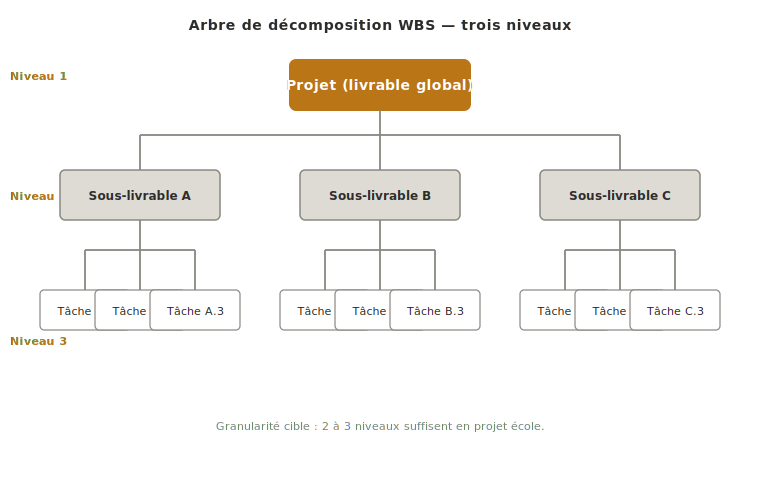
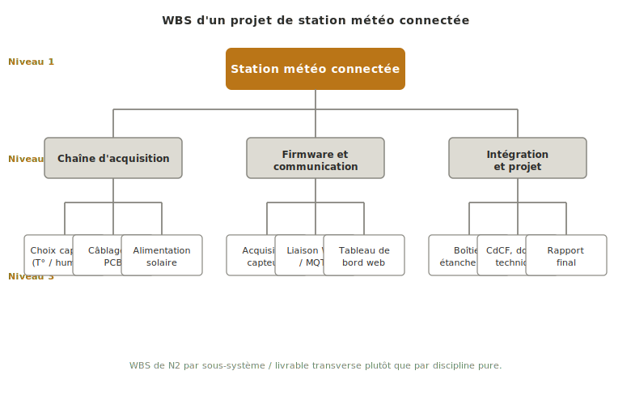

Le **WBS** (*Work Breakdown Structure*) est l'outil de découpage d'un projet en éléments traçables, du livrable global vers les tâches élémentaires. Il sert de référence partagée pour répartir le travail dans l'équipe et garantir qu'aucune tâche structurante n'est oubliée. En projet école, **deux à trois niveaux de profondeur suffisent** : phase → sous-livrable → tâche concrète.

## À quoi ça sert ?

Le WBS rend exhaustif le périmètre du travail à faire avant de tenter de le planifier dans le temps. Sans cette décomposition explicite, l'équipe découvre des tâches en cours de route — *« on n'avait pas pensé qu'il faudrait souder les connecteurs, faire un câble d'alim sur mesure, écrire la doc d'utilisation »* — et le planning dérive d'autant.

Il joue trois rôles :

- **Référence partagée pour la répartition du travail.** Chaque équipier sait quelle branche du WBS il prend en charge et où s'arrêtent ses responsabilités.
- **Garde-fou contre les oublis structurants.** Le geste de descendre méthodiquement du livrable global aux tâches élémentaires fait apparaître les pièces qu'on n'avait pas vues à l'œil nu.
- **Socle direct du [[retroplanning|rétroplanning]] et du [[gantt|Gantt]].** Les feuilles du WBS deviennent les barres du Gantt ; un Gantt sans WBS amont est un dessin sans contenu.

## Comment le construire ?

Trois temps :

1. **Partir du livrable global** (ici, le projet mécatronique complet) et le décomposer en **phases du cycle en V** : spécification, concept, preuve de concept, dossier technique, intégration et tests.
2. **Décomposer chaque phase en sous-livrables identifiables.** Pour la phase de spécification, on aura par exemple le CdCF, l'état de l'art, la matrice de risques, le Gantt. Chaque sous-livrable doit pouvoir être désigné par un nom sans ambiguïté.
3. **Descendre d'un niveau supplémentaire si nécessaire** jusqu'aux tâches concrètes confiables à une personne sur une durée de l'ordre de quelques jours. S'arrêter à ce niveau — un WBS qui descend plus fin bascule en gestion administrative et perd son utilité de pilotage.

*Illustration sur un cas concret : WBS d'un projet de station météo connectée, découpé par sous-système plutôt que par discipline.*

## Pièges

**Confondre WBS et organigramme d'équipe.** Le WBS décompose le **travail**, pas les personnes. *« Branche Antoine / Branche Salma / Branche Karim »* n'est pas un WBS, c'est une affectation — qui vient après la décomposition, pas avant.

**Aller trop profond.** Deux à trois niveaux suffisent en projet école. À cinq ou six niveaux, le WBS devient ingérable, personne ne le rouvre, et l'équipe revient à un suivi informel — autant ne pas en faire.

**Découpage par discipline plutôt que par livrable.** Un WBS *« Élec / Méca / Info »* à la racine est tentant mais masque les livrables transverses (le CdCF, le dossier de concept, le rapport final) qui n'appartiennent à aucune discipline en propre. Partir des phases du V est plus robuste — la répartition par discipline vient au niveau 2 ou 3.

## Voir aussi

- [[specification-technique|Spécification technique]] — étape 5 où le WBS du projet est construit
- [[jalons|Jalons]] — points de validation qui structurent les niveaux supérieurs du WBS
- [[retroplanning|Rétroplanning]] — étape suivante : caler les tâches du WBS dans le temps
- [[gantt|Gantt]] — matérialisation visuelle des tâches du WBS sur le calendrier
- [[gestion-de-projet|Gestion de projet]] — fil transverse qui maintient le WBS vivant au fil des phases
