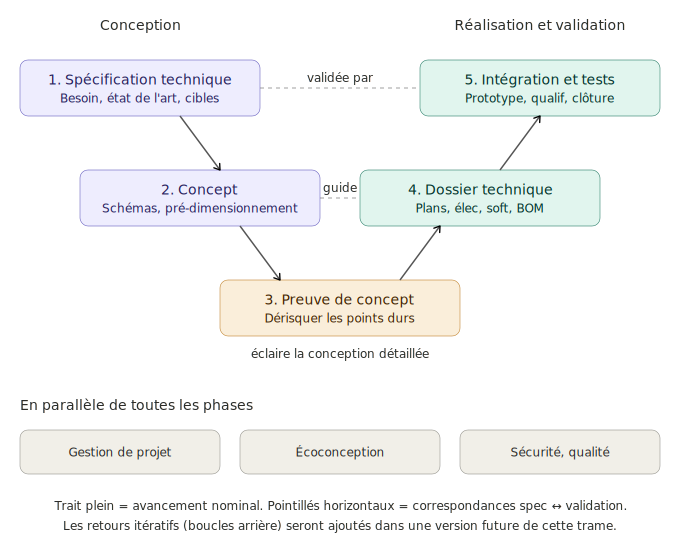

Le **parcours projet** décrit les cinq phases successives d'un projet mécatronique étudiant, du besoin initial à la soutenance finale. Il suit une logique de **cycle en V** : la branche descendante définit progressivement le système (spécification, concept, preuve de concept), la branche ascendante le réalise et le valide (dossier technique, intégration et tests). Cette trame structure l'ensemble du tutoriel et sert de point d'entrée pour situer chaque notion, chaque outil et chaque livrable dans le déroulé du projet.

## Le cycle en V

## Les cinq phases

1. [Spécification technique](#1-spécification-technique) — traduire un besoin en exigences techniques mesurables
2. [Concept](#2-concept) — choisir une architecture et la pré-dimensionner
3. [Preuve de concept](#3-preuve-de-concept) — dérisquer les points durs avant la conception détaillée
4. [Dossier technique](#4-dossier-technique) — produire tous les documents permettant la fabrication
5. [Intégration et tests](#5-intégration-et-tests) — assembler, qualifier, conclure le projet

Chaque phase produit un livrable identifiable et conditionne la suivante. Aucune phase n'est validée tant que son livrable n'est pas accepté en revue.

## 1. Spécification technique

> [!question] Question centrale
> Que doit faire le système, dans quel contexte, et pour qui ?

L'équipe traduit un besoin (souvent flou en début de projet) en exigences techniques mesurables. Cette phase regroupe l'analyse du besoin, l'étude du contexte d'usage, l'état de l'art des solutions existantes, la prise en compte des contraintes d'[[ecoconception]], et la formalisation des cibles de performance.

> [!livrable] Livrable principal
> Le [[cahier-des-charges-fonctionnel]], complété d'un dossier de spécification technique.

**À lire ensuite** : [[specification-technique]] (à venir).

## 2. Concept

> [!question] Question centrale
> Quelle architecture technique répond à la spec, et tient-elle la route en pré-dimensionnement ?

L'équipe choisit un concept parmi plusieurs candidats, le décrit par des schémas (notamment le [[schema-bloc-fonctionnel]], le [[schema-cinematique]], la [[chaine-energie]]), et vérifie par un pré-dimensionnement rapide que les ordres de grandeur tiennent (puissance, autonomie, encombrement).

> [!livrable] Livrable principal
> Un dossier de concept présentant le schéma bloc, les diagrammes de chaînes, et les calculs de pré-dimensionnement.

**À lire ensuite** : [[concept]] (à venir).

## 3. Preuve de concept

> [!question] Question centrale
> Les points techniques incertains du concept fonctionnent-ils réellement ?

Avant d'engager toute la conception détaillée, l'équipe identifie les **points durs** du concept (régulation à atteindre, communication à valider, composant à caractériser) et les teste sur un montage minimal. Si un point dur échoue, la spec ou le concept évolue **avant** que l'erreur coûte cher.

Cette phase est l'occasion d'apprendre une compétence ingénieur essentielle : le **dérisquage amont**. Plutôt que de tout concevoir puis tester, on teste tôt ce qui peut faire échouer le projet.

> [!livrable] Livrable principal
> Un ou plusieurs prototypes minimaux démontrant que les points durs sont maîtrisés, accompagnés d'une mise à jour de la spec et du concept si besoin.

**À lire ensuite** : [[preuve-de-concept]] (à venir).

## 4. Dossier technique

> [!question] Question centrale
> Comment fabrique-t-on le système, pièce par pièce, ligne de code par ligne de code ?

L'équipe produit l'ensemble des documents permettant de réaliser le prototype : plans de détail et d'assemblage, nomenclature (BOM), schémas électriques, routage [[pcb|PCB]], algorithmes embarqués, simulations, et le plan de qualification produit (comment on validera que le système répond à la spec).

> [!livrable] Livrable principal
> Le dossier technique complet, suffisant pour qu'une équipe extérieure puisse fabriquer et tester le système.

**À lire ensuite** : [[dossier-technique]] (à venir).

## 5. Intégration et tests

> [!question] Question centrale
> Le prototype assemblé satisfait-il la spec, et le projet est-il clos proprement ?

L'équipe fabrique, assemble et câble le prototype, puis exécute le plan de qualification : chaque fonction décrite dans la spec est testée, mesurée, validée ou identifiée comme écart. L'assemblage doit être sûr et présentable. La phase se conclut par la soutenance, le rapport final et le retour d'expérience (REX).

> [!livrable] Livrable principal
> Prototype fonctionnel, dossier de qualification, soutenance et REX.

**À lire ensuite** : [[integration-et-tests]] (à venir).

## En parallèle de toutes les phases

Trois activités ne sont pas des phases mais des **fils continus** présents de la première à la dernière semaine du projet :

- **[[gestion-de-projet]]** : planning, suivi des tâches, gestion des risques, communication équipe, revues intermédiaires. Une équipe qui ne pilote pas son projet le subit.
- **[[ecoconception]]** : analyse de cycle de vie, choix de matériaux, sobriété énergétique. Ne se décide pas en fin de projet — chaque choix de conception engage l'empreinte environnementale.
- **[[securite-et-qualite]]** : analyse des risques produit et utilisateur, conformité aux normes, qualité des livrables. À considérer dès la spec, pas après le premier accident.

Ces fils sont évalués transversalement : ils apparaissent dans les livrables de chaque phase, pas dans une phase dédiée.

## Comment lire ce site

Le tutoriel comporte **trois types de fiches** que tu reconnaîtras au champ `type:` dans leur en-tête :

- **Fiches trame** : décrivent une phase du cycle en V. Denses, détaillées, elles guident la production des livrables attendus. La présente fiche est une fiche trame.
- **Fiches tuto** : montrent comment mettre en œuvre un outil ou une méthode (installer un IDE, comprendre les GPIO d'un microcontrôleur, fabriquer un PID numérique). Pratiques, orientées action.
- **Fiches notion** : rappels courts (tension, résistance, couple, force) faisant le pont avec d'autres cours. À consulter en cas de doute sur une base.

## Entrée par domaine

Pour une lecture orientée révision (chercher une notion par discipline plutôt que par phase de projet) :

- [[../fiches/eee/index|EEE]] — Électronique et informatique embarquée
- [[../fiches/meo/index|MEO]] — Méthodes, organisation, animation
- [[../fiches/proj/index|PROJ]] — Démarche projet
- [[../fiches/mme/index|MME]] — Matériaux, mécanique (renvoie vers les cours collègues)
- [[../fiches/ese/index|ESE]] — Écoconception, ACV (renvoie vers les cours collègues)

Chaque fiche du site indique en en-tête les phases du parcours dans lesquelles elle est mobilisée.
